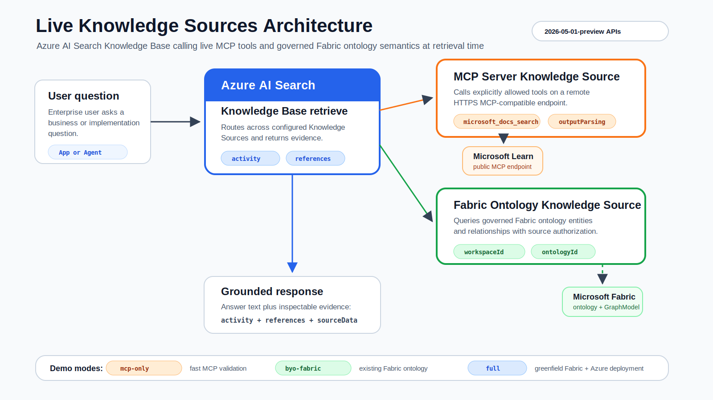

# Azure AI Search Foundry IQ Live Knowledge Sources

Reusable sample accelerator for building Foundry IQ Knowledge Bases with two live, query-time Azure AI Search Knowledge Sources:

- **MCP Server Knowledge Source** for remote HTTPS MCP tools
- **Fabric Ontology Knowledge Source** for governed business semantics in Microsoft Fabric

## Start Here: Choose A Demo Path


If you are new to the repo, start with `mcp-only`. It proves the Azure AI Search MCP Server Knowledge Source path without requiring Fabric setup. Move to `byo-fabric` when you have Fabric workspace and ontology IDs. Use `full` when you want the greenfield platform story that creates the sample Fabric assets before deploying the Azure AI Search side.

| Path | Use when | What gets created | Success signal |
| --- | --- | --- | --- |
| `mcp-only` | Fastest first run, no Fabric dependency | Azure AI Search, Azure OpenAI, Microsoft Learn MCP Server KS, MCP-only KB, Search index, demo app | MCP retrieve returns activity or references from `microsoft_docs_search`. |
| `byo-fabric` | You already have Fabric semantic assets | Everything in `mcp-only`, plus Fabric Ontology KS and combined KB | Fabric retrieve works with delegated source authorization, or offline replay clearly explains what is missing. |
| `full` | You want a zero-to-demo platform run | Fabric capacity, workspace, Lakehouse, ontology, GraphModel, then Azure AI Search, both KS paths, and demo app | Fabric IDs are generated, KS/KB assets are created, app loads, and cleanup evidence is recorded. |

Recommended first commands:

```bash
# 1. Fastest path: validate MCP Server Knowledge Source.
bash scripts/deploy.sh --mode mcp-only --env-name liveks-mcp --location eastus

# 2. Primary Fabric live path: connect an existing Fabric ontology.
bash scripts/deploy.sh \
  --mode byo-fabric \
  --env-file .env.external.local \
  --env-name liveks-byo \
  --location eastus

# 3. Greenfield platform path: create Fabric sample assets first.
bash scripts/deploy.sh \
  --mode full \
  --env-name liveks-full \
  --location eastus \
  --fabric-location westus3
```

Recommended learning order:

1. Run `mcp-only` to validate the MCP Server Knowledge Source path.
2. Run `byo-fabric` if you already have Fabric semantic assets.
3. Use `full` for the end-to-end platform demo after quota, region, and delegated auth expectations are clear.

The repo includes a small synthetic Airline Operations sample dataset and ontology contract. Fabric examples use fictional carrier names and real airport geography, so they are safe for public sample usage while still showing realistic semantic joins and trace behavior.

## Current Status

- `mcp-only`: first-run validation path.
- `byo-fabric`: primary customer/field live path when Fabric assets already exist.
- `full`: validated greenfield path in an external tenant; creates Fabric sample assets before `azd up`.
- Demo app: Azure Static Web Apps + managed Functions API, with offline replay fallback.
- Generated deployment summaries and E2E reports are written under ignored `deployments/` paths.

Before opening a PR or pushing to a Microsoft org repo, run:

```bash
bash scripts/validate-local.sh
```

## First Five Minutes

If you are evaluating the repo for the first time, use this path:

1. Run local validation:

   ```bash
   bash scripts/validate-local.sh
   ```

2. Read the mode selector in [docs/02-choose-a-pattern.md](docs/02-choose-a-pattern.md).
3. Deploy `mcp-only` for the lowest-friction live path.
4. Open the demo app after deployment and inspect **Current Demo Flow** and **Source Trace**.
5. Use [docs/12-reviewer-evidence.md](docs/12-reviewer-evidence.md) to understand what proves a good run.
6. Review [docs/13-public-preview-limitations.md](docs/13-public-preview-limitations.md) before making customer-facing or blog claims.
7. Move to `byo-fabric` or `full` only after you are ready to validate Fabric workspace, ontology, region quota, and delegated auth.

## Preview Notice

This sample uses Azure AI Search public preview Knowledge Source APIs. API versions, request shapes, and service behavior can change. Keep preview API versions explicit, validate against the linked Learn manuals, and do not use checked-in sample settings for production workloads without a security and governance review.

## Why This Repo Exists

Classic retrieval samples usually start with ingestion: load documents, build an index, then query the index. These two preview Knowledge Sources are different. They let a Knowledge Base call live sources at retrieval time:

- MCP Server KS can call explicitly allowed tools on a remote MCP-compatible HTTPS server.
- Fabric Ontology KS can query a Fabric ontology on behalf of the signed-in user.
- A single Knowledge Base can route across both sources and return `activity`, `references`, and source-specific data for validation.
- Offline replay samples show the expected trace shape before you have live keys or Fabric access.

That makes this repo useful as a field-ready starting point for demos, customer workshops, hackathons, and reusable platform assets.

## Primary Manuals

The samples track the Azure AI Search preview manuals:

- [Create an MCP Server knowledge source](https://learn.microsoft.com/azure/search/agentic-knowledge-source-how-to-mcp-server)
- [Create a Fabric Ontology knowledge source](https://learn.microsoft.com/azure/search/agentic-knowledge-source-how-to-fabric-ontology)
- [Create a knowledge base](https://learn.microsoft.com/azure/search/agentic-retrieval-how-to-create-knowledge-base)
- [Query a knowledge base](https://learn.microsoft.com/azure/search/agentic-retrieval-how-to-retrieve)

These capabilities use the `2026-05-01-preview` REST API. Preview behavior and schemas can change, so keep the API version explicit when you adapt the samples.

## What You Will Build



The initial quickstart proves the MCP Server path. The Fabric path is added when your Fabric workspace and ontology item IDs are ready. The combined path shows how a Knowledge Base can use both live grounding sources behind one retrieval endpoint.

## Scenarios

| Scenario | What it proves | Start here |
| --- | --- | --- |
| MCP Server quickstart | Azure AI Search can call a remote MCP tool at retrieve time | `samples/rest/01-create-mcp-server-ks.http` |
| Trace inspection | You can verify source selection, tool calls, and references | `samples/rest/03-retrieve-mcp.http` |
| Fabric Ontology grounding | A Knowledge Base can query governed Fabric semantics with end-user source authorization | `samples/rest/04-create-fabric-ontology-ks.http` |
| Combined routing | One Knowledge Base can route across MCP and Fabric live sources | `samples/rest/05-create-combined-kb.http` |
| Sample catalog | Data, ontology, REST, Python helpers, and offline responses | [samples/README.md](samples/README.md) |
| REST sample sequence | Raw request order for MCP-only, BYO Fabric, and combined retrieval | [samples/rest/README.md](samples/rest/README.md) |
| Notebook walkthroughs | Guided MCP and Fabric tutorials with offline replay defaults | [notebooks/README.md](notebooks/README.md) |
| Airline Ops ontology contract | A concrete sample domain for Fabric BYO ontology validation | `docs/fabric-ontology-prerequisites.md` |
| Fabric live BYO validation | Two-minute path for existing Fabric workspace/ontology IDs | `docs/11-fabric-live-byo-validation.md` |
| Reviewer evidence map | How to review local validation, E2E reports, offline traces, and cleanup evidence | [docs/12-reviewer-evidence.md](docs/12-reviewer-evidence.md) |
| Preview limitations | Public-preview caveats, auth boundaries, quota expectations, and safe claims | [docs/13-public-preview-limitations.md](docs/13-public-preview-limitations.md) |
| Release readiness | Checklist before broader review, workshops, blogs, or official sample promotion | [docs/14-release-readiness-checklist.md](docs/14-release-readiness-checklist.md) |
| Repository promotion | Safe staging-to-target-org promotion flow for private review | [docs/15-repository-promotion.md](docs/15-repository-promotion.md) |
| Demo walkthrough | Three-minute app walkthrough, workshop path, safety checks, and fallback plan | [docs/16-demo-walkthrough.md](docs/16-demo-walkthrough.md) |
| Storyline and safe claims | Blog/presentation framing, approved claim shapes, and pre-publish checks | [docs/17-storyline-and-safe-claims.md](docs/17-storyline-and-safe-claims.md) |
| Private review workflow | Sanitized review request flow, local packet generation, and feedback triage | [docs/18-private-review-workflow.md](docs/18-private-review-workflow.md) |
| Offline replay | Trace inspection without live keys or tenant access | [samples/responses/README.md](samples/responses/README.md) |
| One-command deployment | Azure resources, MCP KS/KB, demo app, and generated summary | `docs/10-one-command-deployment.md` |

## Integration Flow

Every path in this repo follows the same four-step loop:

```text
Create Knowledge Source
  -> Attach it to a Knowledge Base
    -> Retrieve with knowledgeSourceParams
      -> Inspect activity, references, and sourceData
```

The REST files show the raw API calls. The notebook gives the same flow as a guided tutorial:

- `notebooks/01-mcp-server-ks-quickstart.ipynb`
- `notebooks/02-fabric-ontology-ks-airline-ops.ipynb`
- `docs/08-test-queries.md`

## Airline Ops Demo Data

The Fabric tutorial uses a small synthetic Airline Operations domain:

```text
samples/data/airline-ops/
samples/ontology/airline-ops/ontology-contract.yaml
docs/fabric-ontology-prerequisites.md
```

Expected validation facts:

| Validation item | Expected value |
| --- | ---: |
| Airlines | 5 |
| Airports | 8 |
| Flights | 15 |
| Delayed flights over 15 minutes | 10 |
| Delay events | 10 |
| Customer-care exposure | 15800 USD |

Use `byo-fabric` when you already have a Fabric workspace and ontology. Use `full` when you want the sample to create the Fabric capacity, workspace, Lakehouse tables, and ontology before it connects Azure AI Search.

## Quickstart: MCP Server KS

This path has the least setup because it uses the public Microsoft Learn MCP endpoint:

```text
https://learn.microsoft.com/api/mcp
```

1. Copy `.env.sample` to `.env` for your own notes. The REST files use inline variables so they also work directly in VS Code REST Client.
2. Set `@searchEndpoint`, `@searchApiKey`, and `@apiVersion` in `samples/rest/01-create-mcp-server-ks.http`.
3. Set Azure OpenAI model variables in `samples/rest/02-create-mcp-only-kb.http`.
4. Run `samples/rest/01-create-mcp-server-ks.http` to create `microsoft-learn-mcp-ks`.
5. Run `samples/rest/02-create-mcp-only-kb.http` to create a Knowledge Base with only the MCP source.
6. Run `samples/rest/03-retrieve-mcp.http`.
7. Inspect:
   - `activity[*].type`
   - `activity[*].knowledgeSourceName`
   - `activity[*].toolName`
   - `references[*].type`
   - `references[*].sourceData`

This is the first "known good" path for the repository. After this works, add Fabric.

For private local testing, you can point the notebook at an untracked env file by setting `LIVE_KS_ENV_FILE=/path/to/.env`. Do not copy tenant values into tracked docs, notebooks, or sample responses.

## Add Fabric Ontology KS

Fabric Ontology KS requires tenant-specific Fabric assets and end-user source authorization for live retrieval.

1. Review `docs/fabric-ontology-prerequisites.md`.
2. Load or map the sample Airline Ops data into your Fabric workspace.
3. Create an ontology item that matches `samples/ontology/airline-ops/ontology-contract.yaml`.
4. Validate the sample natural-language questions in Fabric.
5. Set `@fabricWorkspaceId` and `@fabricOntologyId` in `samples/rest/04-create-fabric-ontology-ks.http`.
6. Run `samples/rest/04-create-fabric-ontology-ks.http`.
7. Run `samples/rest/05-create-combined-kb.http` to update the Knowledge Base with both MCP and Fabric sources.
8. Acquire an end-user access token scoped to `https://search.azure.com/.default`.
9. Set `@userSearchToken` in `samples/rest/06-retrieve-fabric-ontology.http` as the raw token value, without a `Bearer` prefix.
10. Run the retrieve request and inspect `sourceData.fabricAnswer` and `sourceData.fabricRawData`.

To test the combined path, run `samples/rest/08-retrieve-combined-airline-ops.http`.

## Deploy The Demo App

The deployment uses Azure Developer CLI, Bicep, and post-provision scripts:

Choose the deployment path explicitly:

| Mode | Use when | Command shape |
| --- | --- | --- |
| `byo-fabric` | You already have a Fabric workspace and ontology | `bash scripts/deploy.sh --mode byo-fabric ...` |
| `mcp-only` | You want to validate MCP Server KS first, without Fabric | `bash scripts/deploy.sh --mode mcp-only ...` |
| `full` | You want a greenfield path that also creates Fabric sample assets | `bash scripts/deploy.sh --mode full ...` |

Recommended validated path:

```bash
bash scripts/deploy.sh \
  --mode byo-fabric \
  --env-file .env.external.local \
  --env-name liveks-byo \
  --location eastus
```

`byo-fabric` creates the Azure AI Search, Azure OpenAI, MCP KS/KB, sample Search index, and demo app resources, then connects the existing Fabric ontology from `FABRIC_WORKSPACE_ID` and `FABRIC_ONTOLOGY_ID`.

For MCP-only validation:

```bash
bash scripts/deploy.sh \
  --mode mcp-only \
  --env-name liveks-mcp \
  --location eastus
```

For the full greenfield path:

```bash
bash scripts/deploy.sh \
  --mode full \
  --env-name liveks-full \
  --location eastus \
  --fabric-location westus3
```

`full` creates an F2 Fabric capacity, Fabric workspace, Airline Ops Lakehouse, Airline Ops ontology, and ontology-backed GraphModel before `azd up`, then deploys Azure AI Search, Azure OpenAI, MCP KS/KB, Fabric KS/KB, the Search index, and the demo app. Use `--fabric-location` for a region where your subscription has Fabric quota. If you already have Fabric assets, use `byo-fabric` or set `FABRIC_WORKSPACE_ID` and `FABRIC_ONTOLOGY_ID`.

`deploy.sh` adds a clear ASCII progress view, preflight checks, local app validation, post-provision smoke tests, and an ignored deployment log under `.deployment/`. Running `bash scripts/deploy.sh` without `--mode` only works when `DEPLOYMENT_MODE` is already set in the env file or selected azd environment; otherwise it stops and prints the available paths.

For a full create-call-load-delete rehearsal:

```bash
bash scripts/e2e-test.sh \
  --mode byo-fabric \
  --env-file .env.external.local \
  --env-name ext-liveks-e2e-20260616 \
  --location eastus \
  --cleanup
```

The deployment creates Azure AI Search, Azure OpenAI, Storage, an Azure Static Web Apps demo with managed Functions API, MCP Knowledge Source, MCP-only Knowledge Base, a combined Knowledge Base skeleton, and an Airline Ops Search index for regulation-style sample documents.

After provisioning, `scripts/postprovision.py` writes:

```text
deployments/<env>/deployment-summary.md
```

This generated file is ignored by git and contains the app URL, endpoints, resource names, notebook values, and MCP smoke-test status without secrets.

See `docs/10-one-command-deployment.md`.

## Repository Layout

```text
docs/
  00-overview.md              Conceptual overview
  01-architecture.md          Architecture and MCP direction notes
  02-choose-a-pattern.md      Which sample path to run first
  03-mcp-server-ks.md         MCP Server KS deep dive
  04-fabric-ontology-ks.md    Fabric Ontology KS deep dive
  05-combined-kb-routing.md   Multi-source routing guidance
  06-security-governance.md   Auth, boundaries, and governance notes
  07-troubleshooting.md       Common setup and retrieve issues
  08-test-queries.md          Validation queries and expected traces
  09-offline-replay.md        Offline response inspection
  10-one-command-deployment.md
  11-fabric-live-byo-validation.md
  12-reviewer-evidence.md
  13-public-preview-limitations.md
  14-release-readiness-checklist.md
  15-repository-promotion.md
  external-tenant-login.md
  fabric-ontology-prerequisites.md

infra/
  Bicep deployment for Azure AI Search, Azure OpenAI, Storage, and demo hosting

scripts/
  deploy.sh                   azd wrapper with progress output
  destroy.sh                  azd cleanup wrapper
  e2e-test.sh                 Live create-call-load-delete test harness
  external-tenant-login.sh     Isolated Azure CLI login for external tenants
  postprovision.py            Creates KS/KB, sample index, smoke test, and summary

static-app/
  Static Web Apps demo with managed Functions retrieve proxy routes

demo-app/
  Optional Next.js/App Service reference implementation

samples/data/airline-ops/
  Synthetic tutorial data for the Fabric ontology path

samples/ontology/airline-ops/
  README.md
  Ontology contract for BYO Fabric mapping

samples/python/
  README.md
  build_payloads.py            Generates sample JSON payloads from reusable helpers
  inspect_retrieve_response.py Summarizes activity and references from a saved response

samples/rest/
  README.md
  01-create-mcp-server-ks.http
  02-create-mcp-only-kb.http
  03-retrieve-mcp.http
  04-create-fabric-ontology-ks.http
  05-create-combined-kb.http
  06-retrieve-fabric-ontology.http
  07-delete-resources.http
  08-retrieve-combined-airline-ops.http

samples/responses/
  README.md
  Offline retrieve responses for MCP, Fabric, and combined traces

notebooks/
  README.md
  01-mcp-server-ks-quickstart.ipynb       Guided MCP Server KS tutorial
  02-fabric-ontology-ks-airline-ops.ipynb Guided Fabric Ontology KS tutorial

src/ks_factory/
  Reusable Python payload builders for Knowledge Sources and Knowledge Bases

evals/
  Source routing evaluation skeleton

assets/
  Architecture diagrams and presentation visuals
```

## Python Helpers

Generate sample payloads:

```bash
python samples/python/build_payloads.py
```

Inspect a saved retrieve response:

```bash
python samples/python/inspect_retrieve_response.py samples/responses/mcp-retrieve.sample.json
python samples/python/inspect_retrieve_response.py samples/responses/fabric-airline-ops-retrieve.sample.json
python samples/python/inspect_retrieve_response.py samples/responses/combined-airline-ops-retrieve.sample.json
```

The helper code is intentionally small. It is here to make payload shape reusable, not to hide the REST contract.

## Security And Governance Notes

- Use API keys only for fast proof-of-concept work.
- Prefer Microsoft Entra ID and Azure RBAC for reusable/customer-ready implementations.
- MCP Server KS requires a remote HTTPS MCP server. Local stdio MCP servers cannot be attached directly.
- MCP tools must be explicitly allowed in the Knowledge Source definition.
- Query-time MCP header passthrough is the right pattern for per-user or rotating credentials.
- Fabric Ontology KS uses on-behalf-of source authorization. Pass the raw end-user Search access token separately with `x-ms-query-source-authorization`.
- Pass the raw token in `x-ms-query-source-authorization`; don't prefix it with `Bearer`.
- MCP Server KS retrieve requests don't support `minimal` retrieval reasoning effort; this sample uses `low` and includes the model block required for answer synthesis.
- Do not commit customer data, tenant IDs, service URLs, API keys, live retrieve outputs, or internal planning docs.

## What Good Looks Like

A good validation run should prove more than "the answer looks reasonable." It should show:

- the expected Knowledge Source was selected,
- the expected MCP tool or Fabric ontology was called,
- references are present when requested,
- source data is inspectable during validation,
- failures are understandable from `activity`,
- authentication boundaries are clear.

## Status

This is an accelerator scaffold for public preview features, not a production product or SLA-backed reference architecture. Treat it as a reusable starting point, validate in your tenant, and keep the official Learn manuals as the source of truth while the APIs evolve.
