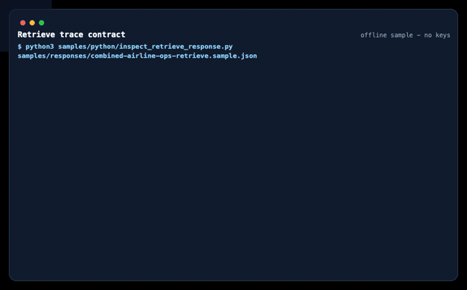
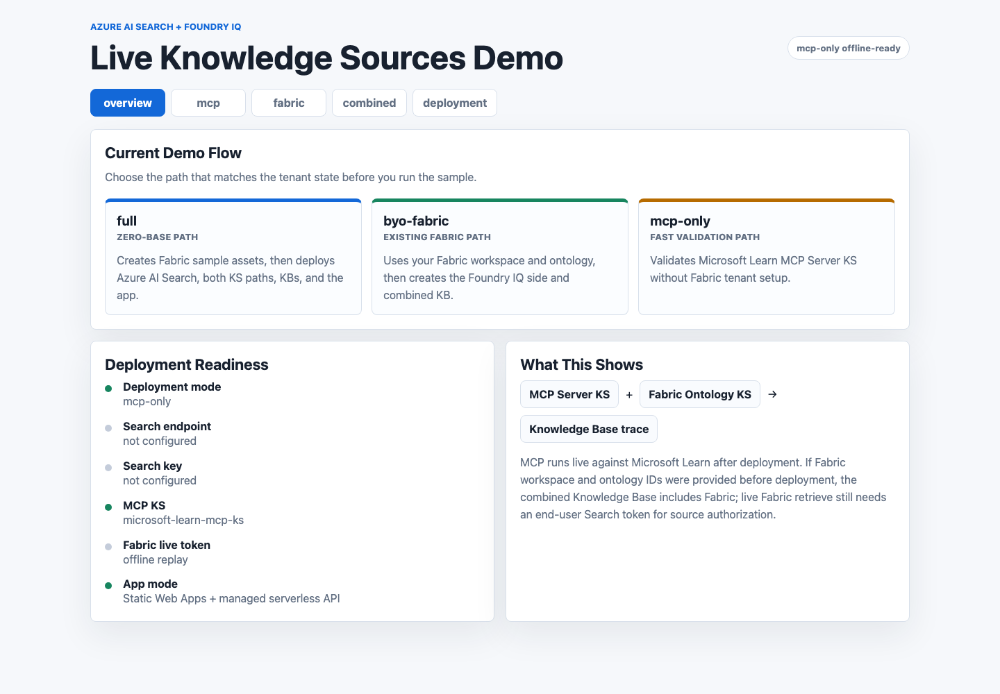
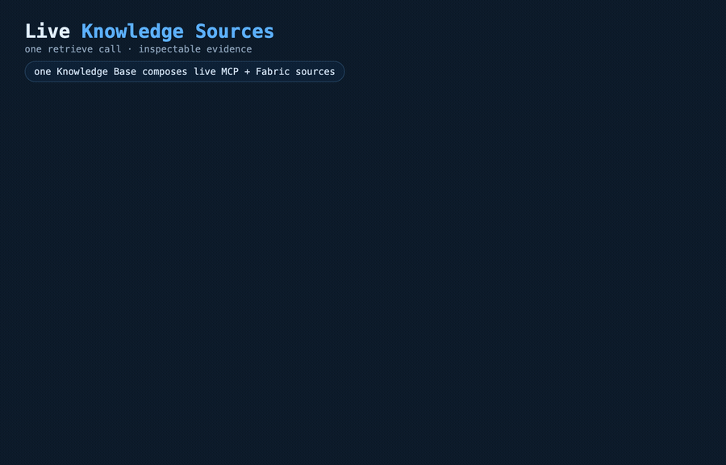

# Live Knowledge Sources for Azure AI Search

> Query-time MCP and Fabric Ontology grounding for Foundry IQ:
> see which live source answered, which tool ran, and which references came back.

[](LICENSE)


One Knowledge Base can route a query to live MCP tools and governed Fabric semantics, then return the trace contract: `activity`, `references`, and `sourceData`.

**🎬 See it in action** — a ~5 min walkthrough from `git clone` to a verified deployment (`clone → local mock → test → deploy → verify → cleanup`), with real footage of the demo app and an executed notebook (offline / dry-run — no secrets on screen).

[](https://github.com/microsoft/azure-ai-search-foundry-iq-live-knowledge-sources/releases/tag/walkthrough-v1)

⬇ Download the full video: [English (5 min)](https://github.com/microsoft/azure-ai-search-foundry-iq-live-knowledge-sources/releases/download/walkthrough-v1/repo-quickstart-guide-en.mp4) · [한국어 (5분)](https://github.com/microsoft/azure-ai-search-foundry-iq-live-knowledge-sources/releases/download/walkthrough-v1/repo-quickstart-guide.mp4) &nbsp;·&nbsp; [chapters &amp; how to rebuild](video-guide/README.md)

## What This Is

- **MCP Server Knowledge Source** calls allowed tools on a remote HTTPS MCP server during Knowledge Base retrieval.
- **Fabric Ontology Knowledge Source** grounds answers in governed Fabric semantics with delegated source authorization.
- **One Knowledge Base** can route across both sources and return inspectable `activity`, `references`, and `sourceData`.

This is a reusable sample accelerator, not a production reference architecture. It uses Azure AI Search public preview Knowledge Source APIs (`2026-05-01-preview`). Keep the [official Learn manuals](#primary-manuals) as the source of truth while preview behavior evolves.

## Why This Repo

- **See the trace, not just the docs.** Offline responses show the actual retrieve contract: which source ran, which tool was called, and what evidence came back.
- **Run it in 30 seconds with zero setup.** Learn the contract without Azure keys, tenant access, or a Fabric workspace.
- **Go live with one command.** Move from offline replay to `mcp-only`, `byo-fabric`, or `full` deployment paths when you are ready.

This repo complements the official Learn manuals by packaging runnable payloads, notebooks, deployment scripts, and offline evidence around the same preview APIs.

## What You'll Learn

1. Inspect offline retrieve traces with no cloud setup.
2. Walk through MCP Server KS and Fabric Ontology KS in notebooks.
3. Deploy a live demo app and verify the same trace contract against your tenant.

## Try It In 30 Seconds

No Azure subscription, keys, tenant, or Fabric workspace required:

```bash
python3 samples/python/inspect_retrieve_response.py samples/responses/mcp-retrieve.sample.json
```

You should see `Activity`, `References`, and `Source Data Preview` sections.

Try the combined offline trace:

```bash
python3 samples/python/inspect_retrieve_response.py samples/responses/combined-airline-ops-retrieve.sample.json
```



It shows Fabric Ontology activity for Airline Ops business data and MCP Server activity for Microsoft Learn implementation guidance.

## Deploy A Live Demo

Choose the path that matches your tenant state.


| Mode | Use when | Command |
| --- | --- | --- |
| `mcp-only` | You want the fastest live validation without Fabric. | `bash scripts/deploy.sh --mode mcp-only --env-name liveks-mcp --location eastus` |
| `byo-fabric` | You already have a Fabric workspace and ontology. | `bash scripts/deploy.sh --mode byo-fabric --env-file .env.external.local --env-name liveks-byo --location eastus` |
| `full` | You want a greenfield run that creates sample Fabric assets first. | `bash scripts/deploy.sh --mode full --env-name liveks-full --location eastus --fabric-location westus3` |

Before deploying, install `azd`, `az`, `python3`, `node`, and `npm`, then sign in. See [deployment prerequisites](docs/10-one-command-deployment.md#prerequisites).

The default app is Azure Static Web Apps plus a managed Functions API. Browser code never receives Search admin keys or Azure OpenAI keys.

Safety defaults: the deploy wrapper validates templates, payloads, and the app before provisioning; failed deployments print cleanup commands; generated Fabric IDs are saved for teardown; and `destroy.sh` continues to `azd down --purge --force` even if Fabric cleanup needs manual follow-up.



The app is one way to view the same trace contract. It reveals the response in stages so you can explain query, answer, source activity, references, and source data during a demo. For a longer presenter flow, see [Demo Walkthrough](docs/16-demo-walkthrough.md).

## How It Works

The Knowledge Base composes the live sources. Each retrieve call can hint which sources to use through `knowledgeSourceParams`, then the response exposes `activity`, `references`, and `sourceData`.

<p align="center">
  
</p>

Every path follows the same loop:

```text
Create Knowledge Source
  -> attach it to a Knowledge Base
    -> retrieve with a test question
      -> inspect activity, references, and sourceData
```

The sample uses a synthetic Airline Operations domain with fictional carrier names and real airport geography. It is safe for public demos while still showing realistic semantic joins and trace behavior.

## What Gets Created

| Path | Knowledge Sources | Other assets |
| --- | --- | --- |
| `mcp-only` | Microsoft Learn MCP Server KS | Azure AI Search, Azure OpenAI, MCP-only KB, Search index, demo app |
| `byo-fabric` | MCP Server KS + Fabric Ontology KS | Everything in `mcp-only`, plus a combined KB connected to your Fabric ontology |
| `full` | MCP Server KS + generated Fabric Ontology KS | Fabric capacity/workspace/Lakehouse/ontology/GraphModel, Azure resources, combined KB, demo app |

Generated deployment logs and reports stay under ignored paths such as `.deployment/` and `deployments/`.

## Learn More

| Need | Start here |
| --- | --- |
| Pick a deployment path | [Choose a Pattern](docs/02-choose-a-pattern.md) |
| Understand the architecture | [Architecture](docs/01-architecture.md) |
| Learn MCP Server KS | [MCP Server Knowledge Source](docs/03-mcp-server-ks.md) |
| Learn Fabric Ontology KS | [Fabric Ontology Knowledge Source](docs/04-fabric-ontology-ks.md) |
| Understand combined routing | [Combined Knowledge Base Routing](docs/05-combined-kb-routing.md) |
| Run the one-command deployment | [One-Command Demo Deployment](docs/10-one-command-deployment.md) |
| Connect existing Fabric assets | [Fabric Live BYO Validation](docs/11-fabric-live-byo-validation.md) |
| Inspect offline traces | [Offline Replay](docs/09-offline-replay.md) |
| Review repo and agent boundaries | [Repo Boundaries](docs/12-repo-boundaries.md) |
| Troubleshoot setup and retrieve issues | [Troubleshooting](docs/07-troubleshooting.md) |
| Check common questions | [FAQ](docs/19-faq.md) |
| Review preview caveats | [Public Preview Limitations](docs/13-public-preview-limitations.md) |

## Primary Manuals

- [Create an MCP Server knowledge source](https://learn.microsoft.com/azure/search/agentic-knowledge-source-how-to-mcp-server)
- [Create a Fabric Ontology knowledge source](https://learn.microsoft.com/azure/search/agentic-knowledge-source-how-to-fabric-ontology)
- [Create a knowledge base](https://learn.microsoft.com/azure/search/agentic-retrieval-how-to-create-knowledge-base)
- [Query a knowledge base](https://learn.microsoft.com/azure/search/agentic-retrieval-how-to-retrieve)

## Repository Map

```text
docs/                 Concept, deployment, troubleshooting, and FAQ
infra/                Bicep for Azure AI Search, Azure OpenAI, Storage, and app hosting
scripts/              Deploy, destroy, E2E, Fabric, validation, and postprovision helpers
static-app/           Canonical demo app for Azure Static Web Apps + Functions
samples/rest/         Raw REST request sequence
samples/python/       Small helper scripts for payload generation and trace inspection
samples/responses/    Offline retrieve responses
samples/data/         Synthetic Airline Ops data
samples/ontology/     Airline Ops ontology contract
notebooks/            Guided MCP and Fabric tutorials
src/ks_factory/       Reusable Python payload builders
assets/               Diagrams and demo screenshots
```

## Local Validation

Run this before opening a PR or sharing the sample broadly:

```bash
bash scripts/validate-local.sh
```

The gate checks shell syntax, Python compile, Python contract tests, notebook JSON, Markdown links, sample hygiene, payload generation, offline responses, no-secret scan, Static Web Apps build, and Bicep build when Azure CLI is available.

For agent-readable preflight, run:

```bash
python3 tools/doctor.py --format json
python3 tools/validate.py --profile offline --format json
```

## Security Notes

- Do not commit tenant IDs, service URLs, API keys, bearer tokens, raw live responses, generated deployment reports, or local screenshots with sensitive values.
- MCP Server KS requires a remote HTTPS MCP server. Local stdio MCP servers cannot be attached directly.
- Fabric live retrieve requires a raw end-user Search access token in `x-ms-query-source-authorization`; do not prefix it with `Bearer`.
- Offline replay is for learning trace shape. It is not proof of live Fabric retrieval.

## Contributing

Issues and PRs are welcome. Please read [CONTRIBUTING.md](CONTRIBUTING.md), [SECURITY.md](SECURITY.md), and [SUPPORT.md](SUPPORT.md).

This project is licensed under the [MIT License](LICENSE).
