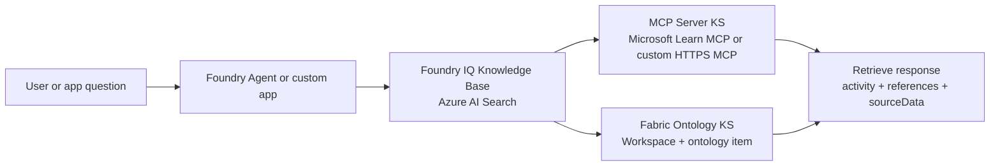

# Azure AI Search Foundry IQ Live Knowledge Sources

Reusable sample accelerator for building Foundry IQ Knowledge Bases with two live, query-time Azure AI Search Knowledge Sources:

- **MCP Server Knowledge Source** for remote HTTPS MCP tools
- **Fabric Ontology Knowledge Source** for governed business semantics in Microsoft Fabric

The fastest path in this repo uses the public Microsoft Learn MCP endpoint, so you can create a working live Knowledge Source before you have tenant-specific Fabric assets ready.

## Why This Repo Exists

Classic retrieval samples usually start with ingestion: load documents, build an index, then query the index. These two preview Knowledge Sources are different. They let a Knowledge Base call live sources at retrieval time:

- MCP Server KS can call explicitly allowed tools on a remote MCP-compatible HTTPS server.
- Fabric Ontology KS can query a Fabric ontology on behalf of the signed-in user.
- A single Knowledge Base can route across both sources and return `activity`, `references`, and source-specific data for validation.

That makes this repo useful as a field-ready starting point for demos, customer workshops, hackathons, and reusable platform assets.

## Primary Manuals

The samples track the Azure AI Search preview manuals:

- [Create an MCP Server knowledge source](https://learn.microsoft.com/azure/search/agentic-knowledge-source-how-to-mcp-server)
- [Create a Fabric Ontology knowledge source](https://learn.microsoft.com/azure/search/agentic-knowledge-source-how-to-fabric-ontology)
- [Create a knowledge base](https://learn.microsoft.com/azure/search/agentic-retrieval-how-to-create-knowledge-base)
- [Query a knowledge base](https://learn.microsoft.com/azure/search/agentic-retrieval-how-to-retrieve)

These capabilities use the `2026-05-01-preview` REST API. Preview behavior and schemas can change, so keep the API version explicit when you adapt the samples.

## What You Will Build



The initial quickstart proves the MCP Server path. The Fabric path is added when your Fabric workspace and ontology item IDs are ready. The combined path shows how a Knowledge Base can use both live grounding sources behind one retrieval endpoint.

## Scenarios

| Scenario | What it proves | Start here |
| --- | --- | --- |
| MCP Server quickstart | Azure AI Search can call a remote MCP tool at retrieve time | `samples/rest/01-create-mcp-server-ks.http` |
| Trace inspection | You can verify source selection, tool calls, and references | `samples/rest/03-retrieve-mcp.http` |
| Fabric Ontology grounding | A Knowledge Base can query governed Fabric semantics with delegated user context | `samples/rest/04-create-fabric-ontology-ks.http` |
| Combined routing | One Knowledge Base can route across MCP and Fabric live sources | `samples/rest/05-create-combined-kb.http` |

## Quickstart: MCP Server KS

This path has the least setup because it uses the public Microsoft Learn MCP endpoint:

```text
https://learn.microsoft.com/api/mcp
```

1. Copy `.env.sample` to `.env` for your own notes. The REST files use inline variables so they also work directly in VS Code REST Client.
2. Set `@searchEndpoint`, `@searchApiKey`, and `@apiVersion` in `samples/rest/01-create-mcp-server-ks.http`.
3. Run `samples/rest/01-create-mcp-server-ks.http` to create `microsoft-learn-mcp-ks`.
4. Run `samples/rest/02-create-mcp-only-kb.http` to create a Knowledge Base with only the MCP source.
5. Run `samples/rest/03-retrieve-mcp.http`.
6. Inspect:
   - `activity[*].type`
   - `activity[*].knowledgeSourceName`
   - `activity[*].toolName`
   - `references[*].type`
   - `references[*].sourceData`

This is the first "known good" path for the repository. After this works, add Fabric.

## Add Fabric Ontology KS

Fabric Ontology KS requires tenant-specific Fabric assets and delegated user context.

1. Prepare a Fabric workspace and ontology item.
2. Set `@fabricWorkspaceId` and `@fabricOntologyId` in `samples/rest/04-create-fabric-ontology-ks.http`.
3. Run `samples/rest/04-create-fabric-ontology-ks.http`.
4. Run `samples/rest/05-create-combined-kb.http` to update the Knowledge Base with both MCP and Fabric sources.
5. Acquire an end-user token scoped to `https://search.azure.com/.default`.
6. Set `@userSearchToken` in `samples/rest/06-retrieve-fabric-ontology.http`.
7. Run the retrieve request and inspect `sourceData.fabricAnswer` and `sourceData.fabricRawData`.

## Repository Layout

```text
docs/
  00-overview.md              Conceptual overview
  01-architecture.md          Architecture and MCP direction notes
  02-choose-a-pattern.md      Which sample path to run first
  03-mcp-server-ks.md         MCP Server KS deep dive
  04-fabric-ontology-ks.md    Fabric Ontology KS deep dive
  05-combined-kb-routing.md   Multi-source routing guidance
  06-security-governance.md   Auth, boundaries, and governance notes
  07-troubleshooting.md       Common setup and retrieve issues

samples/rest/
  01-create-mcp-server-ks.http
  02-create-mcp-only-kb.http
  03-retrieve-mcp.http
  04-create-fabric-ontology-ks.http
  05-create-combined-kb.http
  06-retrieve-fabric-ontology.http
  07-delete-resources.http

samples/python/
  build_payloads.py            Generates sample JSON payloads from reusable helpers
  inspect_retrieve_response.py Summarizes activity and references from a saved response

src/ks_factory/
  Reusable Python payload builders for Knowledge Sources and Knowledge Bases

evals/
  Source routing evaluation skeleton

assets/
  Mermaid architecture diagrams
```

## Python Helpers

Generate sample payloads:

```bash
python samples/python/build_payloads.py
```

Inspect a saved retrieve response:

```bash
python samples/python/inspect_retrieve_response.py samples/responses/mcp-retrieve.sample.json
```

The helper code is intentionally small. It is here to make payload shape reusable, not to hide the REST contract.

## Security And Governance Notes

- Use API keys only for fast proof-of-concept work.
- Prefer Microsoft Entra ID and Azure RBAC for reusable/customer-ready implementations.
- MCP Server KS requires a remote HTTPS MCP server. Local stdio MCP servers cannot be attached directly.
- MCP tools must be explicitly allowed in the Knowledge Source definition.
- Query-time MCP header passthrough is the right pattern for per-user or rotating credentials.
- Fabric Ontology KS uses delegated user context. Pass the end-user token separately with `x-ms-query-source-authorization`.
- Do not commit customer data, tenant IDs, service URLs, API keys, live retrieve outputs, or internal planning docs.

## What Good Looks Like

A good validation run should prove more than "the answer looks reasonable." It should show:

- the expected Knowledge Source was selected,
- the expected MCP tool or Fabric ontology was called,
- references are present when requested,
- source data is inspectable during validation,
- failures are understandable from `activity`,
- authentication boundaries are clear.

## Status

This is an accelerator scaffold for public preview features, not a production product or SLA-backed reference architecture. Treat it as a reusable starting point, validate in your tenant, and keep the official Learn manuals as the source of truth while the APIs evolve.
