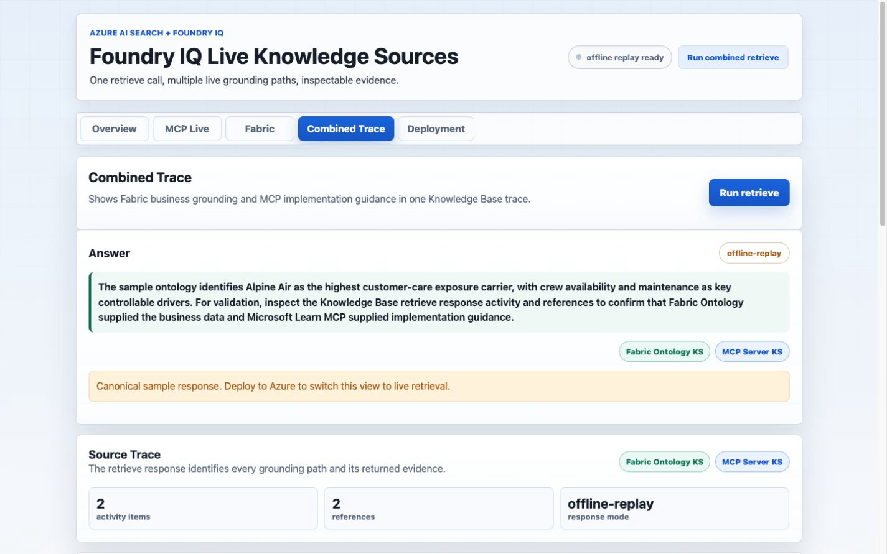

# Foundry IQ Live Knowledge Sources Accelerator

> Deploy and inspect Azure AI Search MCP Server and Fabric Ontology Knowledge Sources through one Foundry IQ Knowledge Base, with source-level evidence for every answer.

[](LICENSE)


[Open the interactive trace demo](https://microsoft.github.io/azure-ai-search-foundry-iq-live-knowledge-sources/demo/?demo=combined) | [Read the execution manual](https://microsoft.github.io/azure-ai-search-foundry-iq-live-knowledge-sources/) | [Watch the KO/EN walkthrough](https://github.com/microsoft/azure-ai-search-foundry-iq-live-knowledge-sources/releases/tag/walkthrough-v1)

## Try It Before Installing

No Azure subscription, tenant access, Fabric workspace, or keys are required:

```bash
git clone --depth 1 https://github.com/microsoft/azure-ai-search-foundry-iq-live-knowledge-sources.git
cd azure-ai-search-foundry-iq-live-knowledge-sources
./liveks try
```

The answer is printed first, followed by MCP Server KS and Fabric Ontology KS evidence from the checked-in combined response. Add `--details` to inspect `activity`, `references`, and `sourceData`.

On Windows PowerShell, run `./liveks.ps1 try`.


## What This Accelerator Does

- **MCP Server Knowledge Source** calls an allowed tool on a remote HTTPS MCP server during Knowledge Base retrieval. The sample uses Microsoft Learn MCP.
- **Fabric Ontology Knowledge Source** grounds the same question in governed Fabric entities and relationships. The sample uses a synthetic Airline Operations domain.
- **Foundry IQ composition** can route one question across either or both sources and returns one answer with inspectable `activity`, `references`, and `sourceData`.
- **Plan-first automation** validates tools, configuration, Bicep, payloads, and the demo app before it creates cloud resources.
- **Ownership-aware cleanup** deletes generated Azure and Fabric assets while preserving BYO Fabric workspaces and ontologies.

This is a reusable public-preview accelerator, not a production reference architecture. The Azure AI Search API version is pinned to `2026-05-01-preview`; use the [official Microsoft manuals](#official-manuals) as the source of truth while preview behavior evolves.

## Go Live

Bootstrap the local CLI once:

```bash
./liveks bootstrap
./liveks profiles
```

Create an ignored YAML configuration, inspect the non-mutating plan, then deploy:

```bash
./liveks init --profile mcp-only --env liveks-mcp
./liveks doctor --env liveks-mcp
./liveks plan --env liveks-mcp
./liveks up --env liveks-mcp
```

`up` shows an Azure preview and cost context, then requires `create liveks-mcp` before provisioning. Use `--yes` only in controlled automation.

| Profile | Use when | Required configuration |
| --- | --- | --- |
| `offline` | You want to learn the retrieve contract without cloud resources. | None |
| `mcp-only` | You want the fastest live validation without Fabric. | Azure sign-in; defaults are otherwise runnable |
| `byo-fabric` | You already have a Fabric workspace and ontology. | `fabric.workspace_id` and `fabric.ontology_id` |
| `full` | You want a greenfield Fabric and Azure deployment. | Fabric quota and explicit `--accept-fabric-capacity` |

For BYO Fabric:

```bash
./liveks init --profile byo-fabric --env liveks-byo
# Edit .liveks/liveks-byo.yaml with the existing workspace and ontology GUIDs.
./liveks plan --env liveks-byo
./liveks up --env liveks-byo
```

For a greenfield run:

```bash
./liveks init --profile full --env liveks-full
./liveks plan --env liveks-full
./liveks up --env liveks-full --accept-fabric-capacity
```

The `full` profile creates a billable Fabric F2 capacity. It never accepts BYO workspace or ontology IDs. Review the plan and run cleanup when the demo is complete.

## One YAML Ledger

Deployment settings live in ignored `.liveks/<environment>.yaml` files:

```yaml
version: 2
profile: byo-fabric
environment: liveks-byo
azure:
  location: eastus
fabric:
  workspace_id: 11111111-1111-1111-1111-111111111111
  ontology_id: 22222222-2222-2222-2222-222222222222
  user_search_token:
    env: FABRIC_USER_SEARCH_TOKEN
```

Secret values are environment references, never YAML literals. LiveKS validates the file, derives names, projects the resolved values into the selected `azd` environment, and writes a redacted lock under `.liveks/`. Legacy dotenv inputs remain available through `--env-file`, but YAML is the canonical v2 path.

See [Configuration](docs/21-configuration.md) for precedence, fields, external-tenant settings, and secret handling.

## Verify And Clean Up

```bash
./liveks verify --env liveks-mcp
./liveks down --env liveks-mcp
```

For a complete create, call, verify, and delete rehearsal:

```bash
./liveks e2e --env liveks-mcp --cleanup --yes
```

`byo-fabric` cleanup deletes only generated Azure resources. `full` cleanup deletes the generated Fabric stack first and then Azure resources; disagreement between the YAML and deployment lock fails closed for Fabric deletion. Successful output includes `resource-group-absent`; when `full` created the capacity, it also includes `fabric-capacity-resource-group-absent` and `fabric-capacity-absent`.

## Architecture


One Knowledge Base composes the live sources. Query-time source options influence routing, while the response itself provides the evidence contract.

```text
Question
  -> Foundry IQ Knowledge Base
    -> MCP Server KS: implementation guidance
    -> Fabric Ontology KS: governed business semantics
  -> one answer + activity + references + sourceData
```

The Airline Ops ontology is supporting sample data, not the main product surface. Its entities, relationships, SVG map, and PNG rendering are documented in the [Airline Ops Ontology Contract](samples/ontology/airline-ops/README.md).

## What Gets Created

| Profile | Knowledge Sources | Other assets |
| --- | --- | --- |
| `mcp-only` | Microsoft Learn MCP Server KS | Azure AI Search, Azure OpenAI, MCP-only KB, Search index, demo app |
| `byo-fabric` | MCP Server KS + Fabric Ontology KS | The same Azure assets plus a combined KB connected to existing Fabric assets |
| `full` | MCP Server KS + generated Fabric Ontology KS | Fabric capacity, workspace, Lakehouse, ontology, GraphModel, Azure assets, combined KB, demo app |

The default app is Azure Static Web Apps with a managed Node.js API. Browser code never receives Search admin keys or Azure OpenAI keys.

<p align="center">
  
</p>

## Manual

| Need | Start here |
| --- | --- |
| Follow the shortest end-to-end sequence | [Execution Runbook](docs/runbook.md) |
| Choose a profile | [Choose a Pattern](docs/02-choose-a-pattern.md) |
| Learn the CLI lifecycle | [LiveKS CLI](docs/20-liveks-cli.md) |
| Author the YAML ledger | [Configuration](docs/21-configuration.md) |
| Deploy and clean up | [One-Command Deployment](docs/10-one-command-deployment.md) |
| Connect existing Fabric assets | [BYO Fabric Validation](docs/11-fabric-live-byo-validation.md) |
| Inspect the evidence contract | [Offline Replay](docs/09-offline-replay.md) |
| Troubleshoot a run | [Troubleshooting](docs/07-troubleshooting.md) |
| Review safety boundaries | [Security and Governance](docs/06-security-governance.md) |
| Check common questions | [FAQ](docs/19-faq.md) |

## Repository Map

```text
liveks, liveks.ps1     Cross-platform lifecycle entry points
config/, profiles/    Canonical schema and executable profile defaults
src/liveks/            Configuration, planning, deploy, verify, and cleanup CLI
infra/                 Bicep for Azure AI Search, Azure OpenAI, Storage, and hosting
scripts/               Hooks, compatibility wrappers, Fabric automation, validation
static-app/            Pages replay UI and Azure Static Web Apps managed API
samples/               REST, Python, responses, synthetic data, and ontology contract
notebooks/             Guided MCP and Fabric walkthroughs
docs/                  Concept, deployment, troubleshooting, and operations manual
```

Generated configuration, locks, deployment evidence, app builds, and logs stay under ignored `.liveks/`, `.deployment/`, `deployments/`, and build directories.

## Local Validation

```bash
bash scripts/validate-local.sh
git diff --check
```

The gate checks CLI profiles and generated examples, Python contracts, notebooks, links, sample and repository hygiene, secrets, the Pages demo build, and Bicep.

Agent-readable commands support JSON output:

```bash
./liveks doctor --profile offline --format json
./liveks plan --env liveks-mcp --format json
```

## Security Notes

- Do not commit tenant IDs, service URLs, API keys, bearer tokens, raw live responses, generated reports, or private screenshots.
- MCP Server KS requires a remote HTTPS MCP server. Local stdio MCP servers cannot be attached directly.
- Fabric live retrieve requires a raw end-user Search token in `x-ms-query-source-authorization`; do not prefix it with `Bearer`.
- Offline replay demonstrates response shape. It is not evidence of live Fabric retrieval.

## Official Manuals

- [Create an MCP Server knowledge source](https://learn.microsoft.com/azure/search/agentic-knowledge-source-how-to-mcp-server)
- [Create a Fabric Ontology knowledge source](https://learn.microsoft.com/azure/search/agentic-knowledge-source-how-to-fabric-ontology)
- [Create a knowledge base](https://learn.microsoft.com/azure/search/agentic-retrieval-how-to-create-knowledge-base)
- [Query a knowledge base](https://learn.microsoft.com/azure/search/agentic-retrieval-how-to-retrieve)

Issues and PRs are welcome. Read [CONTRIBUTING.md](CONTRIBUTING.md), [SECURITY.md](SECURITY.md), and [SUPPORT.md](SUPPORT.md). This project is licensed under the [MIT License](LICENSE).
