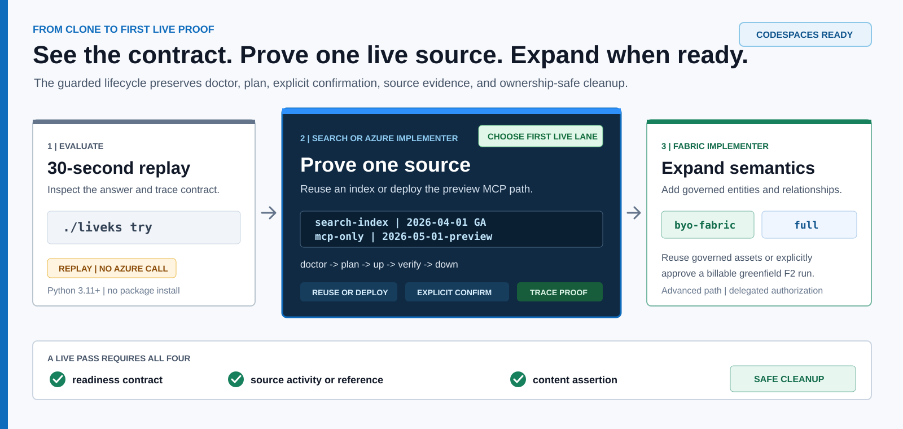
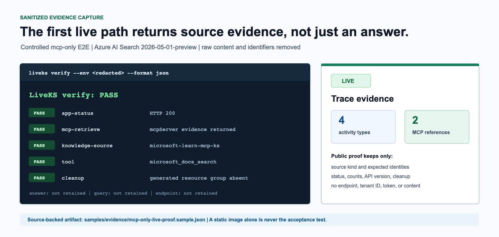
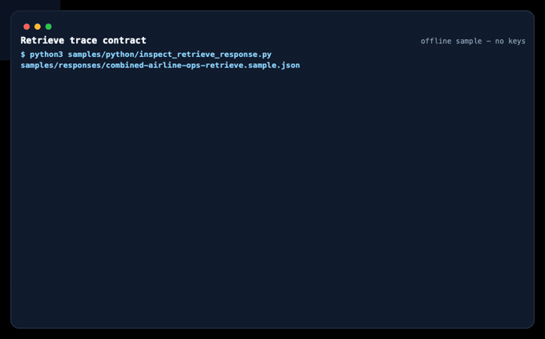

# Foundry IQ Live Knowledge Sources Accelerator

> Go from clone to a proved stable Search Index Knowledge Source, compose it with a preview MCP Server source, then extend the same guarded lifecycle to governed Fabric Ontology sources.

[](LICENSE)
[](https://github.com/microsoft/azure-ai-search-foundry-iq-live-knowledge-sources/actions/workflows/validate.yml)


[](https://codespaces.new/microsoft/azure-ai-search-foundry-iq-live-knowledge-sources)

[Execution manual](https://microsoft.github.io/azure-ai-search-foundry-iq-live-knowledge-sources/) | [First live in Codespaces](docs/15-codespaces-first-live.md) | [Offline trace demo](https://microsoft.github.io/azure-ai-search-foundry-iq-live-knowledge-sources/demo/?demo=combined) | [KO/EN walkthrough](https://github.com/microsoft/azure-ai-search-foundry-iq-live-knowledge-sources/releases/tag/walkthrough-v1)

<p align="center">
  
</p>

This accelerator is for five successive jobs:

| You are here | Finish this | Path |
| --- | --- | --- |
| **Evaluator** | Inspect the answer, activity, references, and source identities without cloud access. | `./liveks try` |
| **Search implementer** | Wrap and prove an existing agentic-ready Search index without transferring ownership. | `search-index` |
| **Knowledge composer** | Add Microsoft Learn MCP to an existing Search index without provisioning a new service. | `mcp-search-index` |
| **Azure implementer** | Deploy and prove one preview MCP Server KS without Fabric. | `mcp-only` |
| **Fabric implementer** | Add an existing or greenfield ontology and prove both source paths. | `byo-fabric` or `full` |

The repository is a reusable accelerator, not a production reference architecture. Coding-agent behavior is specified separately in [AGENTS.md](AGENTS.md); human onboarding stays focused on the outcomes above.

## 30-Second Replay

From a fresh clone, inspect the complete answer-and-evidence contract before installing packages or configuring Azure:

```bash
git clone --depth 1 https://github.com/microsoft/azure-ai-search-foundry-iq-live-knowledge-sources.git
cd azure-ai-search-foundry-iq-live-knowledge-sources
./liveks try --evidence-out .deployment/first-run-evidence.json
```

Python 3.11 or newer is the only requirement. Require `Contract: PASS (4/4 assertions)`: the known synthetic fact, both required activity types, both required reference types, and both Knowledge Source names must be present.

> **REPLAY - NO AZURE CALL:** this command proves the checked-in response contract only. It does not prove that Azure AI Search, MCP Server KS, or Fabric ran live.

The ignored capsule records repository revision, runtime, fixture digest, source counts, and assertion status without query, answer, raw response, or credentials. Pull-request validation runs the same command and retains the capsule as a short-lived workflow artifact.

## Lowest-Risk Live: Existing Search Index

When an agentic-ready Azure AI Search index already exists, use the generally available `2026-04-01` lane before preview-only sources:

```bash
./liveks bootstrap
./liveks init --profile search-index --env liveks-index
# Fill endpoint, index_name, semantic_configuration_name, and optional field lists.
./liveks doctor --env liveks-index
./liveks plan --env liveks-index
./liveks up \
  --env liveks-index \
  --query "<question answerable from the index>" \
  --expect-term "<known non-sensitive term>"
```

`doctor` reads the index definition with a transient Microsoft Entra token. `plan` checks stable payloads and name collisions without writes. `up` creates only a Search Index KS and minimal extractive Knowledge Base, then applies the supplied content assertion; the Search service and index remain BYO assets.

Prove a real call with a known non-sensitive term, then clean up:

```bash
./liveks verify \
  --env liveks-index \
  --query "<question answerable from the index>" \
  --expect-term "<known term>"
./liveks down --env liveks-index
```

Require `search-index-retrieve=pass`, `grounding-content=pass`, and `search-index-preserved=pass`. Read the [stable Search Index execution contract](docs/23-search-index-ks.md).

## Compose Existing Search With MCP

When the same Search service can use an existing Azure OpenAI deployment, add a preview MCP Server KS and one combined KB without provisioning infrastructure:

```bash
./liveks init --profile mcp-search-index --env liveks-combined
# Fill the existing Search endpoint/index/semantic configuration and Azure OpenAI endpoint/deployment/model.
./liveks doctor --env liveks-combined
./liveks plan --env liveks-combined
./liveks up \
  --env liveks-combined \
  --query "<question answerable from the index>" \
  --expect-term "<known non-sensitive term>" \
  --combined-query "<question that can use the index and Microsoft Learn>"
```

This profile creates only a GA `2026-04-01` Search Index KS, a `2026-05-01-preview` MCP Server KS, and a preview combined KB. `plan` names every object, API version, ownership boundary, cost, and cleanup action using GET requests only.

`verify` first forces the existing index, then forces MCP, then offers both sources to the combined planner. Require `search-index-retrieve=pass`, `mcp-retrieve=pass`, and `combined-retrieve=pass`. The combined check reports only source evidence found in `activity`, `references`, or `sourceData`; answer text never proves routing.

Cleanup deletes the lock-owned combined KB, MCP KS, and Search Index KS in dependency order, then requires `search-index-preserved=pass`. It never deletes the Search service, index, Azure OpenAI deployment, resource group, or Fabric. Read the [MCP + Search Index execution contract](docs/24-mcp-search-index-kb.md).

## First Preview Live: MCP-Only

Use the checked-in Codespaces environment to avoid installing Python, Node.js, Azure CLI, Bicep, and Azure Developer CLI yourself. Container creation runs only replay, dependency bootstrap, profile listing, and offline doctor; it never signs in or creates cloud resources.

[Open the guarded Codespaces procedure](docs/15-codespaces-first-live.md).

For a local clone, bootstrap and initialize the same profile:

```bash
./liveks bootstrap
./liveks init --profile mcp-only --env liveks-mcp
```

Then sign in and inspect readiness before provisioning:

```bash
az login --tenant <tenant-guid>
azd auth login
./liveks doctor --env liveks-mcp
./liveks plan --env liveks-mcp
```

`plan` is non-provisioning. Review its tool, authentication, resource, duration, and cost checks. Only then run:

```bash
./liveks up --env liveks-mcp
```

`up` first runs an ARM preview and requires the exact confirmation `create liveks-mcp`. It provisions Azure AI Search, Azure OpenAI, hosting, the public Microsoft Learn MCP Server KS, and an MCP-only Knowledge Base, then runs verification. This is one-command provisioning **after readiness passes**, not an unreviewed installer.

Typical duration is 10-20 minutes, subject to subscription, region, and model availability. No Fabric workspace, ontology, capacity, or delegated Fabric token is required.

### Prove It Is Live

```bash
./liveks verify --env liveks-mcp --format json
./liveks mcp \
  --env liveks-mcp \
  --query "What must be configured for an Azure AI Search MCP Server knowledge source?" \
  --expect-term "Azure AI Search"
```

Require all of these, not just a plausible answer:

- `app-status=pass`,
- `mcp-retrieve=pass` backed by `mcpServer` activity or references,
- Knowledge Source `microsoft-learn-mcp-ks`,
- tool `microsoft_docs_search`,
- native MCP `tools-list`, `tools-call`, and `grounding-content` passes.

<p align="center">
  
</p>

This visual is derived from a controlled live E2E run. The auditable, identifier-free record is [mcp-only-live-proof.sample.json](samples/evidence/mcp-only-live-proof.sample.json). It retains source type, expected identities, counts, API version, pass status, and cleanup outcome; it excludes endpoints, tenant identifiers, query, answer, raw response, and credentials. A static image alone is not an acceptance test.

## Expand To Fabric

Move to Fabric only when the first live route is understood and the tenant is ready:

| Profile | Use when | Authored input | Ownership result |
| --- | --- | --- | --- |
| `byo-fabric` | A governed workspace and ontology already exist. | `fabric.workspace_id` and `fabric.ontology_id` in ignored YAML. | Generated Azure assets are deleted; existing Fabric assets are preserved. |
| `full` | An approved greenfield demo must create the sample stack. | Fabric quota plus `--accept-fabric-capacity`. | Generated Azure and Fabric assets are ownership-checked and deleted. |

```bash
./liveks init --profile byo-fabric --env liveks-byo
# Add the existing Fabric IDs to .liveks/liveks-byo.yaml.
./liveks doctor --env liveks-byo
./liveks plan --env liveks-byo
./liveks up --env liveks-byo
```

BYO Fabric typically takes 10-25 minutes after its IDs and delegated authorization are ready. `full` commonly takes 30-60 minutes and creates a billable Fabric F2 capacity. Read [Fabric BYO validation](docs/11-fabric-live-byo-validation.md) or [Fabric prerequisites](docs/fabric-ontology-prerequisites.md) before using either path.

## Components At A Glance

| Component | What it does | Proof to inspect |
| --- | --- | --- |
| **Search Index Knowledge Source** | Wraps an existing agentic-ready Search index for stable extractive retrieval. | `searchIndex` activity or references, expected content, and preserved-index cleanup proof. |
| **MCP Server Knowledge Source** | Calls an allowed tool on a remote HTTPS MCP server during Knowledge Base retrieval. | `mcpServer` activity or references and the invoked tool name. |
| **Fabric Ontology Knowledge Source** | Grounds a business question in governed Fabric entities and relationships. | `fabricOntology` activity or references plus Fabric source data. |
| **Foundry IQ Knowledge Base** | Plans retrieval across attached sources and produces one grounded result. | Answer content, `activity`, `references`, and `sourceData`. |
| **Native Knowledge Base MCP endpoint** | Exposes `knowledge_base_retrieve` to MCP-compatible clients. | `tools/list`, `tools/call`, and a known-fact match. |
| **LiveKS CLI** | Validates, plans, deploys, verifies, invokes MCP, and cleans up. | Stable status envelopes and nonzero failures. |

There are two distinct MCP directions:

```text
Northbound: MCP client -> Knowledge Base MCP endpoint -> Foundry IQ -> Knowledge Source
Southbound: Foundry IQ -> MCP Server Knowledge Source -> remote HTTPS MCP tool
```

The Fabric path uses a native Fabric Ontology Knowledge Source. It is not routed through the external MCP Server KS.

## Confirm Grounding

Do not treat a successful deployment message or final answer as routing proof:

```bash
./liveks verify --env <environment> --format json
```

The verifier checks each source independently before combined planner routing:

| Profile | Required source proof |
| --- | --- |
| `search-index` | Stable retrieve returns extracted text and `searchIndex` activity or references; optional expected terms match. |
| `mcp-search-index` | Independent Search Index and MCP retrieves pass before combined routing evidence is inspected. |
| `mcp-only` | `mcpServer` activity or references from the MCP-only Knowledge Base. |
| `byo-fabric` | MCP evidence plus `fabricOntology` evidence from the Fabric-only Knowledge Base. |
| `full` | Both source checks, generated Fabric readiness, app status, and ownership evidence. |

For the checked-in synthetic Airline Ops contract, Fabric validation asks:

```text
Which airlines have the highest customer-care exposure this month?
```

The sample ontology should rank Alpine Air first and return Fabric activity or references. Another BYO ontology must use a known question and non-sensitive expected fact from its own domain.

Sanitized reports stay under ignored `deployments/<environment>/`. Raw responses, tokens, endpoints, and tenant-specific identifiers must stay out of git. Follow [Post-Deployment Tests](docs/08-test-queries.md) for the trace-level pass/fail contract.

## Call The Knowledge Base Through MCP

After REST evidence proves the source independently, invoke the same single-source Knowledge Base through its native MCP endpoint:

```bash
./liveks mcp \
  --env liveks-mcp \
  --query "What must be configured for an Azure AI Search MCP Server knowledge source?" \
  --expect-term "Azure AI Search"
```

For the checked-in Airline Ops Fabric contract:

```bash
./liveks mcp \
  --env liveks-byo \
  --query "Which airlines have the highest customer-care exposure this month?" \
  --expect-term "Alpine Air"
```

Expected sanitized output:

```text
LiveKS mcp: PASS
[PASS] tools-list: Knowledge Base publishes knowledge_base_retrieve.
[PASS] tools-call: knowledge_base_retrieve returned 1 text block(s).
[PASS] grounding-content: MCP content matched 1/1 expected term(s).
```

Omitting `--expect-term` proves the MCP protocol surface only and leaves grounding at warning. The sample default reads a Search admin key transiently through Azure CLI and never prints or persists it. Organization-managed identities with **Search Index Data Reader** can use `--auth bearer`.

Read [Call the Knowledge Base Through MCP](docs/22-knowledge-base-mcp.md) for authentication, delegated Fabric authorization, and controlled failure handling.

The native `liveks mcp` client targets preview Knowledge Bases. The stable `search-index` profile uses its documented REST retrieve assertion; `mcp-search-index` supports the native endpoint with `--auth bearer` only after the three-step REST source proof.

## Configuration And Compatibility

`.liveks/<environment>.yaml` is the canonical human-authored ledger. `azd env` is generated deployment state. Secret fields use `{env: VARIABLE_NAME}` references; raw values never belong in YAML.

| Profile | Cloud mutation | Required configuration |
| --- | --- | --- |
| `offline` | None | None |
| `search-index` | Generated KS and KB only; service and index reused | Existing endpoint, index, semantic configuration, and Search permissions |
| `mcp-search-index` | Generated combined KB and two KS objects only | Existing Search index, Azure OpenAI deployment, Search managed identity model access, and Search permissions |
| `mcp-only` | Generated Azure resources | Azure sign-in; profile defaults are otherwise runnable |
| `byo-fabric` | Generated Azure resources only | Existing Fabric workspace and ontology IDs |
| `full` | Generated Azure and Fabric resources | Fabric quota and explicit capacity acceptance |

The `search-index` profile is pinned to generally available `2026-04-01` and uses `intents` plus minimal extractive retrieval. `mcp-search-index` explicitly keeps its Search Index KS on `2026-04-01` while using `2026-05-01-preview` for MCP KS, the combined KB, and all three `messages` retrieve calls. The other MCP and Fabric profiles remain preview-only. LiveKS rejects cross-lane API overrides.

Read the [stable vs preview compatibility matrix](docs/14-api-compatibility.md).

Important boundaries:

- Fabric live retrieve requires a raw end-user Search token in `x-ms-query-source-authorization`, without a `Bearer` prefix.
- MCP Server KS requires a reachable remote HTTPS endpoint; local stdio servers cannot be attached directly.
- The native MCP result does not expose separate retrieve `activity` and `references`; prove source execution through REST first.
- Browser code never receives Search admin keys or Azure OpenAI keys.
- Telemetry is disabled by default.
- Do not commit customer data, tenant IDs, workspace or ontology IDs, keys, tokens, raw live responses, or private screenshots.

See [Configuration](docs/21-configuration.md), [Security and Governance](docs/06-security-governance.md), [Troubleshooting](docs/07-troubleshooting.md), and [Public Preview Limitations](docs/13-public-preview-limitations.md).

## Inspect The Offline Trace

Expand the checked-in response without an Azure subscription, tenant, Fabric workspace, or key:

```bash
./liveks try --details
./liveks try --sample mcp --details
```

The answer is printed first, followed by MCP Server KS and Fabric Ontology KS evidence. This is replay only.



## Verify And Clean Up

Before cleanup for a preview deployment, open the App URL in `deployments/<environment>/deployment-summary.md` and complete the [Guided Live Demo](docs/16-demo-walkthrough.md). The stable data-plane profile has no app; run its documented `verify --query --expect-term` assertion instead.

```bash
./liveks down --env <environment>
```

For `search-index` and `mcp-search-index`, require `search-index-preserved=pass`. For provisioned preview deployments, require `resource-group-absent=pass`. A `full` run that generated Fabric capacity must also report `fabric-capacity-absent`, plus either `fabric-capacity-resource-group-absent` for a generated group or `fabric-capacity-resource-group-preserved` for a pre-existing group.

For a controlled end-to-end rehearsal:

```bash
./liveks e2e --env liveks-mcp --cleanup --yes
```

Use exactly one of `--cleanup` or `--keep-resources`. Prefer cleanup and record the owner whenever resources are retained.

## Architecture


```text
Question
  -> Foundry IQ Knowledge Base
    -> MCP Server KS: implementation guidance
    -> Fabric Ontology KS: governed business semantics
  -> grounded result + activity + references + sourceData
  -> native knowledge_base_retrieve MCP tool
```

The Airline Ops data is synthetic supporting material, not the main product surface. See the [Airline Ops Ontology Contract](samples/ontology/airline-ops/README.md).

## Repository Map

```text
.devcontainer/         Reproducible Codespaces and local Dev Container setup
liveks, liveks.ps1     Cross-platform lifecycle entry points
config/, profiles/    Canonical schema and executable profile defaults
src/liveks/            Configuration, planning, deploy, verify, MCP, and cleanup CLI
infra/                 Bicep for Azure AI Search, Azure OpenAI, Storage, and hosting
static-app/            Pages replay UI and Azure Static Web Apps managed API
samples/               REST, Python, responses, synthetic data, evidence, and ontology contract
notebooks/             Guided MCP and Fabric walkthroughs
docs/                  Execution manual, concepts, troubleshooting, and operations
```

Generated configuration, locks, deployment evidence, app builds, and logs stay under ignored `.liveks/`, `.deployment/`, `deployments/`, and build directories.

## Local Validation

```bash
bash scripts/validate-local.sh
git diff --check
```

The gate checks configuration and CLI contracts, safe dev container behavior, notebooks, links, sample and repository hygiene, secrets, the Pages demo build, Windows launcher behavior, and Bicep.

## Official Microsoft Manuals

- [Agentic retrieval overview](https://learn.microsoft.com/azure/search/search-agentic-retrieval-concept)
- [What is a Knowledge Source?](https://learn.microsoft.com/azure/search/agentic-knowledge-source-overview)
- [Create a Search Index knowledge source](https://learn.microsoft.com/azure/search/agentic-knowledge-source-how-to-search-index)
- [Create an MCP Server knowledge source](https://learn.microsoft.com/azure/search/agentic-knowledge-source-how-to-mcp-server)
- [Create a Fabric Ontology knowledge source](https://learn.microsoft.com/azure/search/agentic-knowledge-source-how-to-fabric-ontology)
- [Create a Knowledge Base](https://learn.microsoft.com/azure/search/agentic-retrieval-how-to-create-knowledge-base)
- [Query a Knowledge Base using retrieve or MCP](https://learn.microsoft.com/azure/search/agentic-retrieval-how-to-retrieve)
- [Microsoft Fabric Ontology overview](https://learn.microsoft.com/fabric/iq/ontology/overview)

Issues and PRs are welcome. Read [CONTRIBUTING.md](CONTRIBUTING.md), [SECURITY.md](SECURITY.md), and [SUPPORT.md](SUPPORT.md). This project is licensed under the [MIT License](LICENSE).
