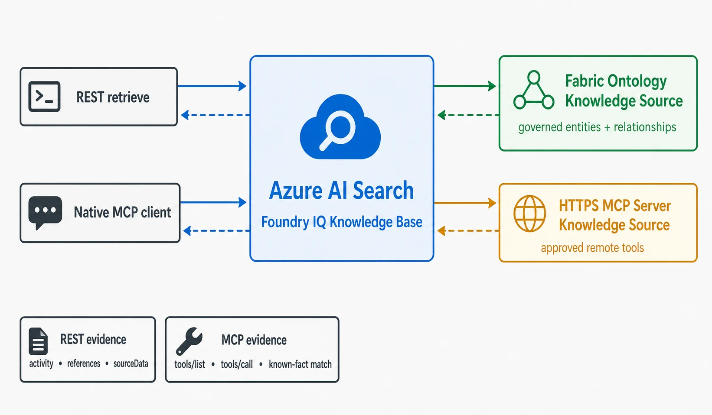

# Foundry IQ Live Knowledge Sources Accelerator

> Platform teams connect a governed Fabric Ontology or remote HTTPS MCP tool, submit a natural-language question to a Foundry IQ Knowledge Base, and receive a grounded result with source evidence that can also be consumed through MCP.

[](LICENSE)


[Read the execution manual](https://microsoft.github.io/azure-ai-search-foundry-iq-live-knowledge-sources/) | [Open the trace demo](https://microsoft.github.io/azure-ai-search-foundry-iq-live-knowledge-sources/demo/?demo=combined) | [Watch the KO/EN walkthrough](https://github.com/microsoft/azure-ai-search-foundry-iq-live-knowledge-sources/releases/tag/walkthrough-v1)

<p align="center">
  
</p>

This public accelerator is designed for managed-organization evaluation, field demos, and implementation review. It is not a production reference architecture.

## Components At A Glance

| Component | What it does | Proof to inspect |
| --- | --- | --- |
| **MCP Server Knowledge Source** | Calls an allowed tool on a remote HTTPS MCP server during Knowledge Base retrieval. | `mcpServer` activity or references and the invoked tool name. |
| **Fabric Ontology Knowledge Source** | Grounds a business question in governed Fabric entities and relationships. | `fabricOntology` activity or references plus Fabric source data. |
| **Foundry IQ Knowledge Base** | Plans retrieval across attached sources and produces one grounded result. | Answer content, `activity`, `references`, and `sourceData`. |
| **Native Knowledge Base MCP endpoint** | Exposes `knowledge_base_retrieve` to MCP-compatible clients. | `tools/list`, `tools/call`, and a known-fact match when source grounding is claimed. |
| **LiveKS CLI** | Validates, plans, deploys, verifies, invokes MCP, and cleans up. | Stable status envelopes and nonzero failures. |

There are two distinct MCP directions:

```text
Northbound: MCP client -> Knowledge Base MCP endpoint -> Foundry IQ -> Knowledge Source
Southbound: Foundry IQ -> MCP Server Knowledge Source -> remote HTTPS MCP tool
```

The representative managed-organization scenario uses the northbound client path with a native Fabric Ontology Knowledge Source. Fabric is not routed through the external MCP Server KS.

## Run One Live Knowledge Source

Use `byo-fabric` when the organization already owns a Fabric workspace and ontology:

```bash
git clone --depth 1 https://github.com/microsoft/azure-ai-search-foundry-iq-live-knowledge-sources.git
cd azure-ai-search-foundry-iq-live-knowledge-sources
./liveks bootstrap
./liveks init --profile byo-fabric --env liveks-byo
```

Edit the ignored `.liveks/liveks-byo.yaml` ledger and add the existing identifiers:

```yaml
version: 2
profile: byo-fabric
environment: liveks-byo
azure:
  location: eastus
fabric:
  workspace_id: 11111111-1111-1111-1111-111111111111
  ontology_id: 22222222-2222-2222-2222-222222222222
```

Then inspect before provisioning and deploy only after reviewing the resource and cost list:

```bash
az login --tenant <tenant-guid>
azd auth login
./liveks doctor --env liveks-byo
./liveks plan --env liveks-byo
./liveks up --env liveks-byo
```

`plan` is non-provisioning. `up` displays the Azure preview and requires `create liveks-byo`. Postprovision creates a Fabric-only Knowledge Base for isolated source validation and a combined Knowledge Base for planner-routing tests. Cleanup later deletes generated Azure resources and preserves the existing Fabric workspace and ontology.

No existing ontology? Use `mcp-only` for the fastest live path. Use `full` only with explicit approval because it creates a billable Fabric F2 capacity.

## Confirm Foundry IQ Grounding

Do not treat a successful deployment message or final answer as routing proof:

```bash
./liveks verify --env liveks-byo --format json
```

For the checked-in synthetic Airline Ops contract, the verifier asks:

```text
Which airlines have the highest customer-care exposure this month?
```

Require a live `fabric-retrieve` pass backed by `fabricOntology` activity or references. The sample ontology should rank Alpine Air first and return Fabric answer and raw grounding fields; another BYO ontology must use a question and expected fact from its own domain.

The verifier writes sanitized status and evidence summaries under ignored `deployments/<environment>/`. Raw responses, tokens, endpoints, and tenant-specific identifiers must stay out of git.

Follow [Post-Deployment Tests](docs/08-test-queries.md) for the exact trace-level pass/fail contract.

## Call It Through MCP

After REST evidence proves the Knowledge Source independently, invoke the same Fabric-only Knowledge Base as an MCP server:

```bash
./liveks mcp \
  --env liveks-byo \
  --query "Which airlines have the highest customer-care exposure this month?" \
  --expect-term "Alpine Air"
```

Expected sanitized output:

```text
LiveKS mcp: PASS
[PASS] tools-list: Knowledge Base publishes knowledge_base_retrieve.
[PASS] tools-call: knowledge_base_retrieve returned 1 text block(s).
[PASS] grounding-content: MCP content matched 1/1 expected term(s).
```

Use `Alpine Air` only when the connected ontology implements the checked-in synthetic contract. For another BYO ontology, use a non-sensitive fact that a known-answer question must return. Omitting `--expect-term` proves the MCP protocol surface only and produces a grounding warning.

The default sample path reads a Search admin key transiently through Azure CLI and never prints or persists it. Organization-managed identities with **Search Index Data Reader** can use `--auth bearer`.

For a controlled Fabric authorization failure:

```bash
./liveks mcp --env liveks-byo --omit-source-authorization --expect-failure
```

The command normalizes external failure text and stores no raw MCP content. The current MCP result returns `result.content[]`, not the retrieve API's separate `activity` and `references`; the acceptance proof is therefore the pair of source-specific `verify` evidence and an `mcp` known-fact match.

Read [Call the Knowledge Base Through MCP](docs/22-knowledge-base-mcp.md) for authentication, evidence, and failure handling.

## Configuration And Known Limitations

| Profile | Use when | Required configuration |
| --- | --- | --- |
| `offline` | Learn the response and evidence contract without cloud resources. | None |
| `mcp-only` | Validate one live MCP Server KS without Fabric. | Azure sign-in; profile defaults are otherwise runnable. |
| `byo-fabric` | Connect an existing Fabric workspace and ontology. | `fabric.workspace_id` and `fabric.ontology_id`. |
| `full` | Rehearse a greenfield Fabric and Azure deployment. | Fabric quota and `--accept-fabric-capacity`. |

`.liveks/<environment>.yaml` is the canonical human-authored ledger. `azd env` is generated deployment state, and dotenv files are compatibility inputs for REST and notebook users. Secret fields use `{env: VARIABLE_NAME}` references; raw values never belong in YAML.

The Azure AI Search API is pinned to `2026-05-01-preview`. Preview behavior has no production SLA and can change. Microsoft Learn is the source of truth for the current API, authentication, MCP response, and Fabric requirements.

Important boundaries:

- Fabric live retrieve requires a raw end-user Search token in `x-ms-query-source-authorization`, without a `Bearer` prefix.
- MCP Server KS requires a reachable remote HTTPS endpoint; local stdio servers cannot be attached directly.
- The native MCP result alone does not identify source activity in separate arrays; use retrieve evidence first and a known-fact match before claiming grounded MCP content.
- The current `knowledge_base_retrieve` MCP tool accepts one `queries` array and cannot carry retrieve-only `knowledgeSourceParams`, including `alwaysQuerySource`.
- Browser code never receives Search admin keys or Azure OpenAI keys.
- Do not commit customer data, tenant IDs, workspace or ontology IDs, keys, tokens, raw live responses, or private screenshots.

See [Configuration](docs/21-configuration.md), [Security and Governance](docs/06-security-governance.md), [Troubleshooting](docs/07-troubleshooting.md), and [Public Preview Limitations](docs/13-public-preview-limitations.md).

## Try Before Going Live

No Azure subscription, tenant, Fabric workspace, or key is needed to inspect the checked-in response contract:

```bash
./liveks try
./liveks try --details
```

The answer is printed first, followed by MCP Server KS and Fabric Ontology KS evidence. This is offline replay only; it does not prove that a live source ran.


## Verify And Clean Up

Before cleanup, open the App URL in `deployments/<environment>/deployment-summary.md` and complete the [Guided Live Demo](docs/16-demo-walkthrough.md).

```bash
./liveks down --env liveks-byo
```

Require `resource-group-absent`. A `full` run that generated Fabric capacity must also report `fabric-capacity-resource-group-absent` and `fabric-capacity-absent`.

For a controlled end-to-end rehearsal:

```bash
./liveks e2e --env liveks-mcp --cleanup --yes
```

Use exactly one of `--cleanup` or `--keep-resources`. Prefer cleanup and record the owner whenever resources are retained.

## Architecture


```text
Question
  -> Foundry IQ Knowledge Base
    -> MCP Server KS: implementation guidance
    -> Fabric Ontology KS: governed business semantics
  -> grounded result + activity + references + sourceData
  -> native knowledge_base_retrieve MCP tool
```

The Airline Ops data is synthetic supporting material, not the main product surface. See the [Airline Ops Ontology Contract](samples/ontology/airline-ops/README.md).

## Repository Map

```text
liveks, liveks.ps1     Cross-platform lifecycle entry points
config/, profiles/    Canonical schema and executable profile defaults
src/liveks/            Configuration, planning, deploy, verify, MCP, and cleanup CLI
infra/                 Bicep for Azure AI Search, Azure OpenAI, Storage, and hosting
static-app/            Pages replay UI and Azure Static Web Apps managed API
samples/               REST, Python, responses, synthetic data, and ontology contract
notebooks/             Guided MCP and Fabric walkthroughs
docs/                  Execution manual, concepts, troubleshooting, and operations
```

Generated configuration, locks, deployment evidence, app builds, and logs stay under ignored `.liveks/`, `.deployment/`, `deployments/`, and build directories.

## Local Validation

```bash
bash scripts/validate-local.sh
git diff --check
```

The gate checks configuration and CLI contracts, notebooks, links, sample and repository hygiene, secrets, the Pages demo build, Windows launcher behavior, and Bicep.

## Official Microsoft Manuals

- [Agentic retrieval overview](https://learn.microsoft.com/en-us/azure/search/search-agentic-retrieval-concept)
- [What is a Knowledge Source?](https://learn.microsoft.com/en-us/azure/search/agentic-knowledge-source-overview)
- [Create an MCP Server knowledge source](https://learn.microsoft.com/en-us/azure/search/agentic-knowledge-source-how-to-mcp-server)
- [Create a Fabric Ontology knowledge source](https://learn.microsoft.com/en-us/azure/search/agentic-knowledge-source-how-to-fabric-ontology)
- [Create a Knowledge Base](https://learn.microsoft.com/en-us/azure/search/agentic-retrieval-how-to-create-knowledge-base)
- [Query a Knowledge Base using retrieve or MCP](https://learn.microsoft.com/en-us/azure/search/agentic-retrieval-how-to-retrieve)
- [Microsoft Fabric Ontology overview](https://learn.microsoft.com/en-us/fabric/iq/ontology/overview)

Issues and PRs are welcome. Read [CONTRIBUTING.md](CONTRIBUTING.md), [SECURITY.md](SECURITY.md), and [SUPPORT.md](SUPPORT.md). This project is licensed under the [MIT License](LICENSE).
