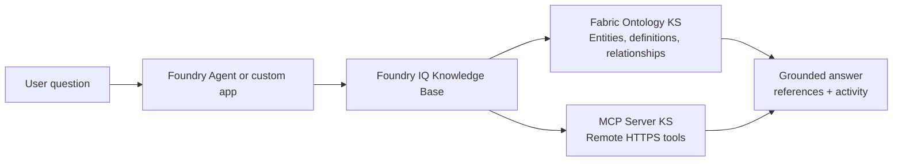

# Architecture



## Northbound MCP vs Southbound MCP

There are two useful MCP directions to distinguish:

```text
Northbound MCP:
  A Knowledge Base is exposed as an MCP server so MCP clients can call it.

Southbound MCP Server KS:
  A Knowledge Base calls an external MCP server as a Knowledge Source.
```

This repository focuses on the southbound MCP Server Knowledge Source pattern.

