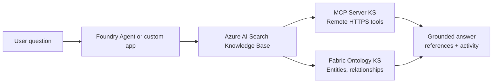

# Architecture


The architecture centers on Azure AI Search Knowledge Base retrieval. A user question enters through a Foundry Agent or custom app, the Knowledge Base calls configured live Knowledge Sources at retrieval time, and the response includes answer text plus inspectable `activity`, `references`, and `sourceData`.



## Northbound MCP vs Southbound MCP

There are two useful MCP directions to distinguish:

```text
Northbound MCP:
  A Knowledge Base is exposed as an MCP server so MCP clients can call it.

Southbound MCP Server KS:
  A Knowledge Base calls an external MCP server as a Knowledge Source.
```

This repository focuses on the southbound MCP Server Knowledge Source pattern.
