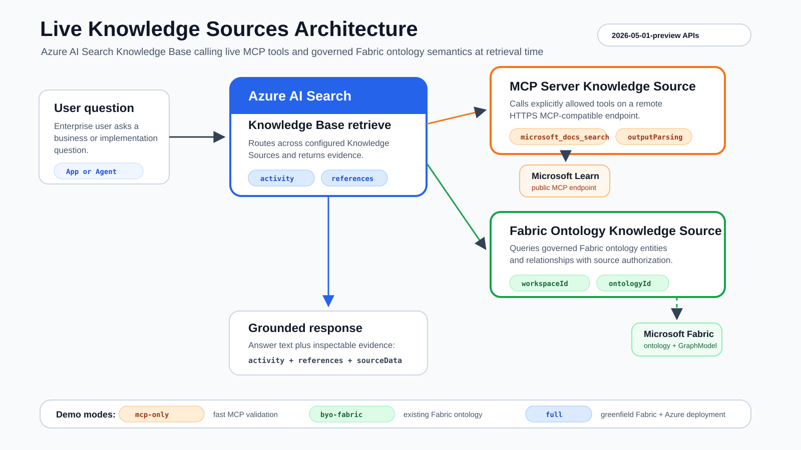
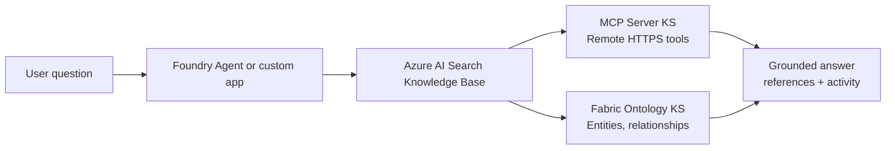

# Architecture



The architecture centers on Azure AI Search Knowledge Base retrieval. A user question enters through a Foundry Agent or custom app, the Knowledge Base calls configured live Knowledge Sources at retrieval time, and the response includes answer text plus inspectable `activity`, `references`, and `sourceData`.


```mermaid
flowchart LR
  User["User question"]
  Agent["Foundry Agent or custom app"]
  MCP["MCP Server KS\nRemote HTTPS tools"]
  Fabric["Fabric Ontology KS\nEntities, relationships"]
  KB["Azure AI Search Knowledge Base"]
  Answer["Grounded answer\nreferences + activity"]

  User --> Agent --> KB
  KB --> MCP
  KB --> Fabric
  MCP --> Answer
  Fabric --> Answer
```

## Northbound MCP vs Southbound MCP

There are two useful MCP directions to distinguish:

```text
Northbound MCP:
  A Knowledge Base is exposed as an MCP server so MCP clients can call it.

Southbound MCP Server KS:
  A Knowledge Base calls an external MCP server as a Knowledge Source.
```

The deployment demonstrates the southbound MCP Server Knowledge Source pattern. The execution manual also validates the northbound endpoint with `./liveks mcp`, so operators can prove the complete client-to-Knowledge-Source path without confusing the two MCP roles.

For the representative managed-organization scenario:

```text
MCP client
  -> Knowledge Base MCP endpoint
    -> Foundry IQ planning and grounding
      -> Fabric Ontology Knowledge Source
  -> MCP text content
```

Use the retrieve API evidence from `./liveks verify` to prove that `fabricOntology` ran. The current native MCP result provides `result.content[]`, but not the retrieve API's separate `activity` and `references` arrays. Pair that trace with `./liveks mcp --expect-term <known-fact>` because a text block by itself proves only protocol execution.

## Trace The Diagram To Executable Proof

The visual architecture is backed by checked-in configuration, implementation, and verification boundaries. Use this map instead of treating the diagram or a successful deployment message as proof by itself.

| Concern | Source of truth | Executable proof | Boundary |
| --- | --- | --- | --- |
| Profile and authored configuration | [`profiles/mcp-search-index.yaml`](https://github.com/microsoft/azure-ai-search-foundry-iq-live-knowledge-sources/blob/main/profiles/mcp-search-index.yaml), [`profiles/three-source.yaml`](https://github.com/microsoft/azure-ai-search-foundry-iq-live-knowledge-sources/blob/main/profiles/three-source.yaml), [`profiles/mcp-only.yaml`](https://github.com/microsoft/azure-ai-search-foundry-iq-live-knowledge-sources/blob/main/profiles/mcp-only.yaml), [`profiles/byo-fabric.yaml`](https://github.com/microsoft/azure-ai-search-foundry-iq-live-knowledge-sources/blob/main/profiles/byo-fabric.yaml), and [`config/schema.yaml`](https://github.com/microsoft/azure-ai-search-foundry-iq-live-knowledge-sources/blob/main/config/schema.yaml) | `./liveks init`, `doctor`, and `plan` as documented in the [MCP execution contract](03-mcp-server-ks.md#one-mcp-execution-contract) | YAML is the ignored human-authored ledger. Unknown fields fail closed and secrets use environment references. |
| MCP Server Knowledge Source and MCP-only Knowledge Base | [`src/ks_factory/mcp_server.py`](https://github.com/microsoft/azure-ai-search-foundry-iq-live-knowledge-sources/blob/main/src/ks_factory/mcp_server.py), [`src/ks_factory/knowledge_base.py`](https://github.com/microsoft/azure-ai-search-foundry-iq-live-knowledge-sources/blob/main/src/ks_factory/knowledge_base.py), and [`scripts/postprovision.py`](https://github.com/microsoft/azure-ai-search-foundry-iq-live-knowledge-sources/blob/main/scripts/postprovision.py) | `./liveks up --env liveks-mcp` creates the source and Knowledge Base after plan, ARM preview, and exact confirmation. | `plan` builds and dry-runs only; `up` is the provisioning boundary. |
| Live retrieve evidence | [`src/liveks/cli.py`](https://github.com/microsoft/azure-ai-search-foundry-iq-live-knowledge-sources/blob/main/src/liveks/cli.py) and [`static-app/api/retrieve-mcp/index.js`](https://github.com/microsoft/azure-ai-search-foundry-iq-live-knowledge-sources/blob/main/static-app/api/retrieve-mcp/index.js) | `./liveks verify --env <environment>` must report the applicable source-specific retrieve check as `pass`. | Read/call only. A live badge plus matching activity or references is required; answer text alone is insufficient. |
| Native Knowledge Base MCP endpoint | [`src/liveks/cli.py`](https://github.com/microsoft/azure-ai-search-foundry-iq-live-knowledge-sources/blob/main/src/liveks/cli.py) and [Knowledge Base MCP Client](22-knowledge-base-mcp.md) | `./liveks mcp --expect-term <known-fact>` must pass `tools-list`, `tools-call`, and `grounding-content`. | Read/call only. Pair MCP content with the source-specific retrieve trace before naming the source that ran. |
| Local and pull-request validation | [`scripts/validate-local.sh`](https://github.com/microsoft/azure-ai-search-foundry-iq-live-knowledge-sources/blob/main/scripts/validate-local.sh), [`.github/workflows/validate.yml`](https://github.com/microsoft/azure-ai-search-foundry-iq-live-knowledge-sources/blob/main/.github/workflows/validate.yml), and [`.github/workflows/pages.yml`](https://github.com/microsoft/azure-ai-search-foundry-iq-live-knowledge-sources/blob/main/.github/workflows/pages.yml) | `bash scripts/validate-local.sh` plus the Linux, Windows, and manual-build checks. | Validate has `contents: read`. A pull request builds the manual and demo but does not upload or deploy Pages; public `main` publishes the manual. |
| Cleanup and ownership | [`src/liveks/config.py`](https://github.com/microsoft/azure-ai-search-foundry-iq-live-knowledge-sources/blob/main/src/liveks/config.py) and [`src/liveks/cli.py`](https://github.com/microsoft/azure-ai-search-foundry-iq-live-knowledge-sources/blob/main/src/liveks/cli.py) | `./liveks down --env <environment>` must pass `resource-group-absent`; generated full capacity also requires both Fabric absence checks. | Generated Azure assets can be deleted. BYO Fabric assets are preserved, and uncertain ownership fails toward preservation. |
