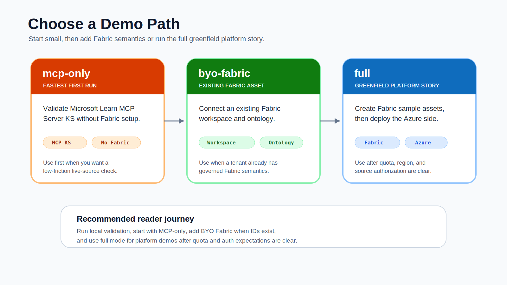

# Choose a Pattern

| Pattern | Use when | Start here |
| --- | --- | --- |
| MCP Server KS | You need a low-friction public preview quickstart or tool-backed live retrieval | `samples/rest/01-create-mcp-server-ks.http` |
| Fabric Ontology KS | You need governed business semantics from Microsoft Fabric | `samples/rest/04-create-fabric-ontology-ks.http` |
| Combined KB | You need to validate multi-source routing and trace behavior | `samples/rest/05-create-combined-kb.http` |

## Deployment Modes

| Mode | Use when |
| --- | --- |
| `byo-fabric` | You already have a Fabric workspace and ontology and want the validated live Fabric path. |
| `mcp-only` | You want the fastest Azure AI Search MCP Server KS validation without Fabric. |
| `full` | You want a greenfield path that creates the Fabric sample stack and connects it to Azure AI Search. |

## Recommended Order

1. Create the MCP Server KS.
2. Create the MCP-only Knowledge Base.
3. Retrieve from MCP and inspect `activity`, `references`, and source data.
4. Add Fabric Ontology KS with BYO Fabric IDs or run `--mode full` to create the sample Fabric assets.
5. Create a combined Knowledge Base and repeat trace validation.

## How To Review A Run

Use [Reviewer Evidence Guide](12-reviewer-evidence.md) when you need to decide whether a run is good enough for private review, a workshop, or a blog/demo walkthrough.

The short version:

- local validation proves the repo shape,
- E2E reports prove create-call-load-delete behavior,
- retrieve traces prove source selection,
- screenshots explain the experience but are not enough by themselves.
