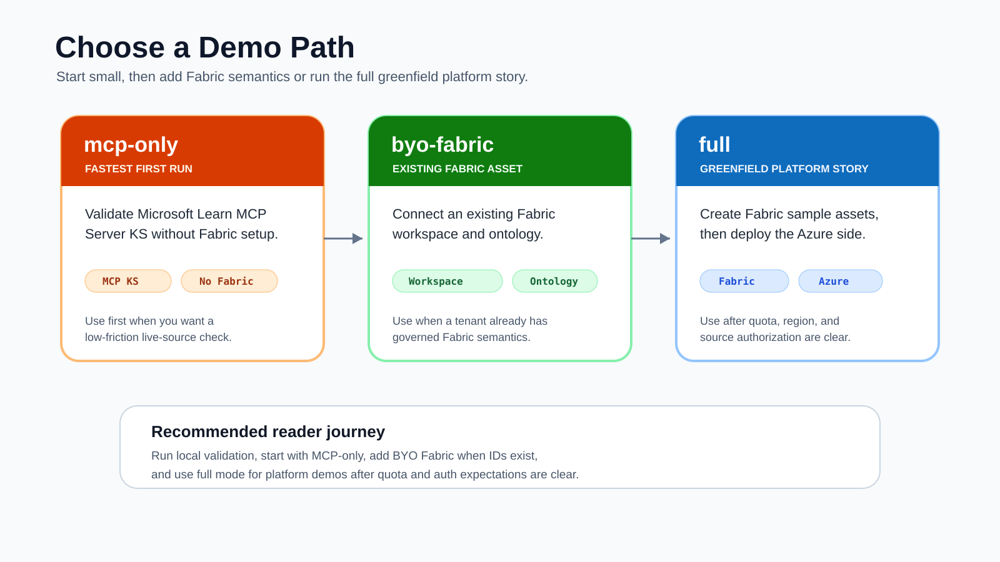

# Choose a Pattern



Start with offline replay, then choose the smallest live profile that proves the behavior you need.

| Profile | Use when | Main risk or prerequisite | Success signal |
| --- | --- | --- | --- |
| `offline` | You need to inspect the response contract immediately. | It proves shape, not live retrieval. | Answer plus MCP and Fabric trace evidence. |
| `mcp-only` | You want the lowest-friction live path. | Azure AI Search preview and model availability. | `microsoft_docs_search` appears in activity or references. |
| `byo-fabric` | Existing governed Fabric semantics should ground retrieval. | Workspace/ontology IDs and delegated user authorization. | Separate checks prove both KS paths; the combined KB shows planner-selected routing. |
| `full` | A greenfield platform demo must create everything. | Billable Fabric F2 quota, longer duration, tenant settings, cleanup. | Fabric GraphModel, both KS paths, app, and teardown pass. |

## Decision

Use `mcp-only` unless the answer to one of these is yes:

- Existing Fabric workspace and ontology IDs are ready: use `byo-fabric`.
- The audience must see Fabric sample creation from zero and quota is confirmed: use `full`.
- No cloud mutation should occur: remain on `offline`.

## Command Shapes

```bash
./liveks init --profile mcp-only --env liveks-mcp
./liveks plan --env liveks-mcp
./liveks up --env liveks-mcp
```

```bash
./liveks init --profile byo-fabric --env liveks-byo
# Add fabric.workspace_id and fabric.ontology_id to .liveks/liveks-byo.yaml.
./liveks plan --env liveks-byo
./liveks up --env liveks-byo
```

```bash
./liveks init --profile full --env liveks-full
./liveks plan --env liveks-full
./liveks up --env liveks-full --accept-fabric-capacity
```

## Source Pattern

| Knowledge Source pattern | Sample entry point |
| --- | --- |
| MCP Server KS | `samples/rest/01-create-mcp-server-ks.http` |
| Fabric Ontology KS | `samples/rest/04-create-fabric-ontology-ks.http` |
| Combined Knowledge Base | `samples/rest/05-create-combined-kb.http` |

Validate single-source Knowledge Bases first when deterministic source evidence matters. In a combined Knowledge Base, query-time `knowledgeSourceParams` provide source options and arguments; the returned `activity` and `references` are the evidence of what actually ran.
