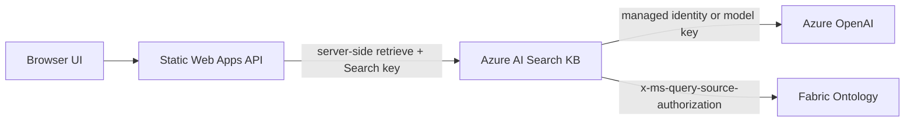

# Security and Governance

## Implementation Model

The sample keeps browser code away from Azure AI Search and Azure OpenAI credentials.

- Postprovision creates Knowledge Sources and Knowledge Bases with a Search admin key. That key is never sent to the browser.
- Fabric live retrieve requires a raw delegated user token per request in `x-ms-query-source-authorization` with scope `https://search.azure.com/.default`.
- Azure OpenAI access uses either a model API key in the Knowledge Base payload or the Search service managed identity with RBAC when no key is provided.
- The demo app always calls the server-side API first; browser code does not call Azure AI Search directly.

## MCP Server KS

- Vet the remote MCP server before connecting it.
- Explicitly allow only required tools.
- Prefer per-request credentials for user-sensitive APIs.
- Monitor tool latency, failures, and output size.
- Keep human oversight for actions that can affect real systems.

## Fabric Ontology KS

- Validate Fabric workspace and ontology permissions.
- Use end-user source authorization when user-specific Fabric access matters.
- Confirm tenant alignment between Azure AI Search and Fabric.
- Confirm region and data handling requirements before production use.

## Repository Safety

- Keep only placeholders in `.env.sample`.
- Do not commit live retrieve payloads that contain sensitive source data.
- Keep sample responses synthetic.

For a reviewer-facing list of preview caveats, quota expectations, and safe public claims, see [Public Preview Limitations and Caveats](13-public-preview-limitations.md).
