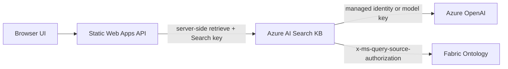

# Security and Governance

## Implementation Model

The sample keeps browser code away from Azure AI Search and Azure OpenAI credentials.

```mermaid
flowchart LR
  Browser["Browser UI"] --> API["Static Web Apps API"]
  API -->|"server-side retrieve + Search key"| Search["Azure AI Search KB"]
  Search -->|"managed identity or model key"| OpenAI["Azure OpenAI"]
  Search -->|"x-ms-query-source-authorization"| Fabric["Fabric Ontology"]
```

- Postprovision creates Knowledge Sources and Knowledge Bases with a Search admin key. That key is never sent to the browser.
- Fabric live retrieve requires a raw delegated user token per request in `x-ms-query-source-authorization` with scope `https://search.azure.com/.default`.
- Azure OpenAI access uses either a model API key in the Knowledge Base payload or the Search service managed identity with RBAC when no key is provided.
- The demo app always calls the server-side API first; browser code does not call Azure AI Search directly.

## MCP Server KS

- Vet the remote MCP server before connecting it.
- Explicitly allow only required tools.
- Prefer per-request credentials for user-sensitive APIs.
- Monitor tool latency, failures, and output size.
- Keep human oversight for actions that can affect real systems.

## Knowledge Base MCP Client

- The default `./liveks mcp --auth admin-key` path is a sample-development convenience. It reads the key transiently through Azure CLI, never prints it, and never persists raw MCP content.
- Prefer `--auth bearer` for organization-managed clients after assigning **Search Index Data Reader** to the client identity.
- The independent consumer accepts endpoint, query, expected term, and credentials only from process environment variables. Populate bearer/admin-key and delegated source tokens with masked input, remove them after the call, and never save them in shell profiles, dotenv files, command arguments, evidence, or tracked configuration.
- Its public output is allowlist-only: check names/status, counts, normalized error category, and non-sensitive mode metadata. It omits endpoints, Knowledge Base names, prompts, expected terms, source identities, headers, response bodies, and text.
- Fabric calls need a separate raw user token in `x-ms-query-source-authorization`; the `Authorization` bearer token and source-authorization token have different roles even when acquired for the same user.
- Keep the generated count-only report under ignored `deployments/`. Do not publish prompts, raw tool content, endpoints, or external error bodies.
- Review the [Microsoft Learn MCP security guidance](https://learn.microsoft.com/en-us/azure/search/agentic-retrieval-how-to-retrieve#call-the-mcp-endpoint) before connecting an agent runtime.

## Fabric Ontology KS

- Validate Fabric workspace and ontology permissions.
- Use end-user source authorization when user-specific Fabric access matters.
- Confirm tenant alignment between Azure AI Search and Fabric.
- Confirm region and data handling requirements before production use.

## Repository Safety

- Keep only placeholders in tracked YAML and dotenv examples.
- Store authored deployment values under ignored `.liveks/`; secret fields must contain environment references, not literals.
- Treat `azd env` as generated deployment state and the redacted LiveKS lock as the cleanup ownership record.
- Do not commit live retrieve payloads that contain sensitive source data.
- Keep sample responses synthetic.
- GitHub Pages runs canonical offline fixtures only. Live credentials and Search requests remain behind the Azure managed API.

## Protected Canary Isolation

- The lifecycle canary has only a manual `workflow_dispatch` trigger and a job condition restricted to the Microsoft repository `main` ref.
- The credentialed job references the `mcp-search-index-live` GitHub Environment. Configure required reviewers and restrict deployment branches before adding secrets.
- Missing environment configuration fails in preflight before Azure login. Messages contain variable names only.
- One concurrency group prevents overlapping runs against the shared BYO target; each run still derives unique generated KS/KB names.
- The canary uses `--cleanup` only and has bounded command and job timeouts plus an `always()` cleanup.
- Only the allowlist-sanitized capsule is uploaded. Detailed reports, ledgers, locks, queries, answers, endpoints, identifiers, and raw payloads remain runner-local.
- Ordinary pull-request and fork validation receives no canary secrets and runs no credentialed job.

See GitHub's official guidance for [deployment environments](https://docs.github.com/actions/how-tos/deploy/configure-and-manage-deployments/manage-environments) and [workflow concurrency](https://docs.github.com/actions/how-tos/write-workflows/choose-when-workflows-run/control-workflow-concurrency).

## Cleanup Governance

- `byo-fabric` owns no Fabric capacity, workspace, or ontology and must never delete them.
- `full` can delete only assets created for its environment.
- LiveKS compares configuration and lock ownership before Fabric deletion; disagreement preserves the asset.
- Manual resource-group deletion requires an inventory and a separate check that no shared Fabric workspace is assigned.

For a reviewer-facing list of preview caveats, quota expectations, and safe public claims, see [Public Preview Limitations and Caveats](13-public-preview-limitations.md).
