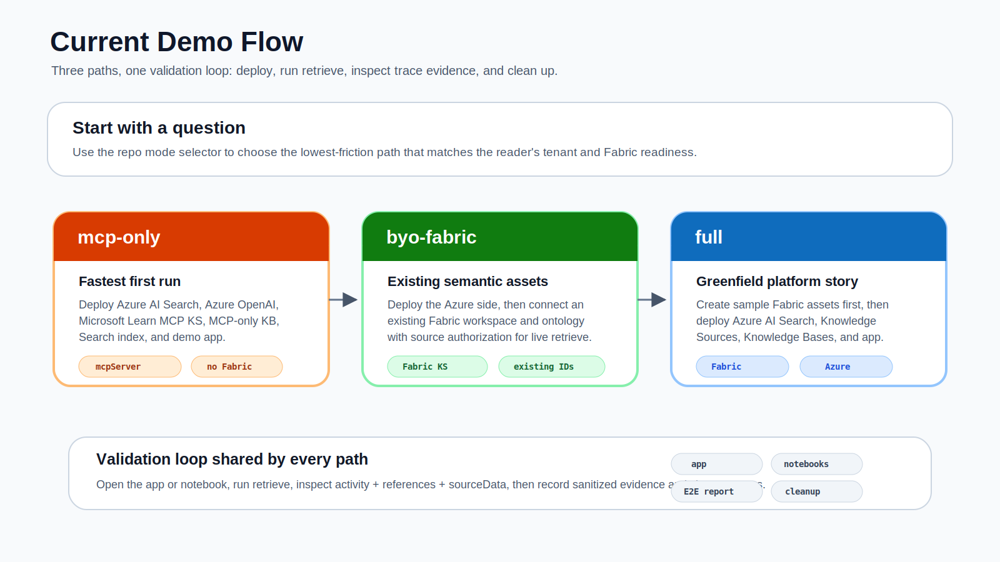

# Demo Walkthrough

Use this walkthrough when you need to show the repo in a workshop or short live demo.



The goal is to explain the sample through one simple loop:

```text
Choose a deployment mode
  -> Run a retrieve query
    -> Inspect activity and references
      -> Decide whether the evidence proves MCP, Fabric, or combined grounding
```

## Before You Start

Run the local validation gate:

```bash
bash scripts/validate-local.sh
```

For a live deployment, choose one mode:

```bash
bash scripts/deploy.sh --mode mcp-only --env-name liveks-mcp --location eastus
```

```bash
bash scripts/deploy.sh \
  --mode byo-fabric \
  --env-file .env.external.local \
  --env-name liveks-byo \
  --location eastus
```

```bash
bash scripts/deploy.sh \
  --mode full \
  --env-name liveks-full \
  --location eastus \
  --fabric-location westus3
```

Do not use private tenant values, generated deployment reports, or local screenshots in public docs unless they have been sanitized.

## Three-Minute Demo

### 1. Start With The Mode Selector

Open [README.md](../README.md) and show the three paths:

| Mode | Message |
| --- | --- |
| `mcp-only` | Fastest first run. Validates Microsoft Learn MCP Server KS without Fabric. |
| `byo-fabric` | Primary Fabric live path. Connects an existing Fabric workspace and ontology. |
| `full` | Greenfield platform story. Creates Fabric sample assets, then connects Azure AI Search. |

Talk track:

```text
This repo packages two public preview live Knowledge Sources into three reusable demo paths.
MCP-only is the quickest validation path.
BYO Fabric is for customers with existing semantic assets.
Full mode is the zero-to-demo platform path when quota and tenant settings are ready.
```

### 2. Show The App Overview

Open the deployed app URL from:

```text
deployments/<env>/deployment-summary.md
```

In the app, start with **Current Demo Flow** and **Deployment Readiness**.

What to point out:

- deployment mode,
- app runtime status,
- MCP live path,
- Fabric live or offline replay status,
- source trace sections.

Do not show secrets, app settings, raw tokens, or private service URLs in screenshots.

### 3. Run MCP Live

Use the MCP panel or `/api/retrieve/mcp`.

Suggested query:

```text
What must be configured to create an Azure AI Search MCP Server knowledge source?
```

Expected evidence:

- MCP Server Knowledge Source is `microsoft-learn-mcp-ks`.
- Activity or references show Microsoft Learn MCP evidence.
- The answer is useful, but the proof is the trace: `activity`, `references`, and source data.

Claim you can make:

```text
Azure AI Search can call a remote HTTPS MCP server at retrieve time and return traceable evidence.
```

### 4. Show Fabric Ontology

Use the Fabric panel or `/api/retrieve/fabric`.

Suggested query:

```text
Which carriers have the highest customer-care exposure this month?
```

Expected evidence in live mode:

- Fabric Ontology Knowledge Source exists.
- The combined or Fabric KB includes the Fabric source.
- Live retrieve uses delegated source authorization.
- Activity or source data shows Fabric Ontology evidence.

Expected behavior without live Fabric auth:

- The app shows offline replay.
- The response explains that Fabric live mode needs Fabric IDs and delegated source authorization.

Claim you can make only with live evidence:

```text
Fabric Ontology KS can ground retrieval on governed Fabric semantics with user source authorization.
```

Safe fallback claim:

```text
Offline replay shows the expected Fabric trace shape while live Fabric auth is being configured.
```

### 5. Show Combined Trace

Use the combined panel or `/api/retrieve/combined`.

Suggested query:

```text
Identify the top customer-care exposure carrier and cite implementation guidance.
```

What to inspect:

- source badges or trace sections,
- activity entries,
- references,
- source-specific data,
- whether the answer used MCP, Fabric, or offline replay.

Claim you can make:

```text
The same Knowledge Base pattern can route across live tools and semantic business data, then expose trace evidence for review.
```

## Ten-Minute Workshop Path

Use this order when the audience needs to reproduce the sample:

1. Run `bash scripts/validate-local.sh`.
2. Read [Choose a Pattern](02-choose-a-pattern.md).
3. Deploy `mcp-only`.
4. Open the app and run the MCP query.
5. Open [MCP Server KS Quickstart](../notebooks/01-mcp-server-ks-quickstart.ipynb).
6. Inspect `samples/rest/01-create-mcp-server-ks.http` through `samples/rest/03-retrieve-mcp.http`.
7. Move to `byo-fabric` when Fabric workspace and ontology IDs are ready.
8. Open [Fabric Ontology KS Airline Ops](../notebooks/02-fabric-ontology-ks-airline-ops.ipynb).
9. Run the combined route and inspect source evidence.

## Demo Safety Checks

Before showing the demo outside the working team:

```text
[ ] Local validation passes
[ ] The app URL is from a current deployment summary
[ ] Screenshots do not expose tenant IDs, tokens, keys, or private endpoints
[ ] Fabric live claims are backed by Fabric activity or source data
[ ] Offline replay is clearly described as offline replay
[ ] Cleanup evidence exists when deployment behavior is being claimed
[ ] Preview caveats match docs/13-public-preview-limitations.md
```

## Failure Fallbacks

| Failure | Use this fallback |
| --- | --- |
| MCP live call fails | Show `samples/responses/mcp-retrieve.sample.json` and the local validation result. |
| Fabric token expires | Show Fabric offline replay and explain delegated source authorization. |
| Full deployment is too slow | Show the generated E2E report summary and deployment mode diagram. |
| App is unavailable | Use the notebooks and REST files to show the same retrieve sequence. |
| Public preview behavior changes | Stop at the Learn manual boundary and update the sample before making claims. |

## What Not To Claim

Avoid these during demos:

- offline replay proves live Fabric retrieval,
- screenshots alone prove source selection,
- `azd up` alone proves retrieve behavior,
- full mode will work in every tenant and region,
- local stdio MCP servers can be attached directly to Azure AI Search.

Use [Public Preview Limitations and Caveats](13-public-preview-limitations.md) for safe wording.
