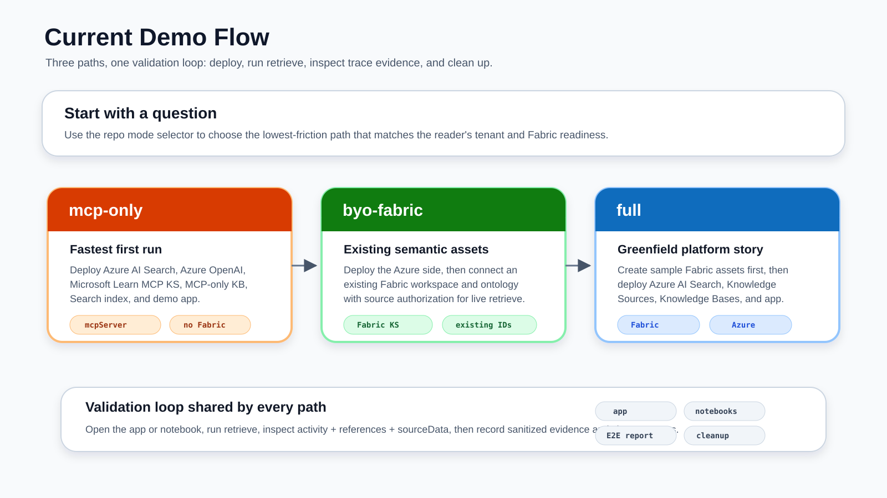

# Guided Live Demo Walkthrough

This is the click-by-click presenter guide for the deployed demo app. It explains what to open, what to select, what question the app sends, what should appear, and what the result proves.

Use [Post-Deployment Tests And Expected Traces](08-test-queries.md) when you need the complete acceptance criteria or additional test questions.



## Choose The Demo You Can Prove

| Available environment | Recommended demo | Time | Valid claim |
| --- | --- | --- | --- |
| No Azure or Fabric access | GitHub Pages replay | 2 minutes | The packaged response and trace inspection experience. |
| `mcp-only` deployed | Status plus MCP Live | 3 minutes | A live Microsoft Learn MCP tool call through Knowledge Base retrieve. |
| `byo-fabric` deployed | MCP, Fabric, then Combined | 7 minutes | Both source paths work independently and the combined planner can route between them. |
| `full` deployed | Deployment, MCP, Fabric, Combined, cleanup | 10 minutes | Greenfield Fabric assets and the complete Azure/Fabric lifecycle work together. |

!!! warning "Match the claim to the badge"
    A realistic answer with an `offline` or `offline-replay` badge is replay evidence. Only a `live` answer with matching activity or references proves a live source call.

## Presenter Preparation

### 1. Deploy And Verify

Use the profile that matches the demo:

```bash
./liveks init --profile mcp-only --env liveks-mcp
./liveks plan --env liveks-mcp
./liveks up --env liveks-mcp
./liveks verify --env liveks-mcp
```

For existing Fabric assets:

```bash
./liveks init --profile byo-fabric --env liveks-byo
# Add the existing Fabric IDs to .liveks/liveks-byo.yaml.
./liveks plan --env liveks-byo
./liveks up --env liveks-byo
./liveks verify --env liveks-byo
```

For greenfield Fabric assets:

```bash
./liveks init --profile full --env liveks-full
./liveks plan --env liveks-full
./liveks up --env liveks-full --accept-fabric-capacity
./liveks verify --env liveks-full
```

Do not begin a live presentation with a failed `verify` result.

### 2. Find The Correct App

Open the generated, ignored summary for the environment you just verified:

```text
deployments/<environment>/deployment-summary.md
```

Copy the **App URL** into a private browser window. Do not present the Search endpoint, tenant IDs, resource names, or the summary itself.

The public [interactive trace demo](https://microsoft.github.io/azure-ai-search-foundry-iq-live-knowledge-sources/demo/?demo=combined) is GitHub Pages replay. Use it when you want to explain the UI without a live environment, and call it replay explicitly.

### 3. Prepare Fabric Authorization

Skip this step for `mcp-only`. For `byo-fabric` or `full`, acquire a fresh raw token just before the demo:

```bash
az account get-access-token \
  --resource https://search.azure.com \
  --query accessToken \
  --output tsv
```

Keep the value off the shared screen. Do not prepend `Bearer`. The browser sends the token for the request but does not persist it; refreshing or closing the page clears the entered value.

The app uses a fixed Airline Ops question for a repeatable demo. `full` creates the matching sample. Before a `byo-fabric` presentation, confirm that the connected ontology maps the Airline Ops contract; otherwise plan to validate the live Fabric trace in the app and use the Fabric notebook or REST sample for a business question that matches the existing ontology.

### 4. Rehearse The Exact Path

Run the same tabs once before the audience joins. Confirm:

- the top status pill shows the expected deployment mode and `live`,
- MCP returns a `live` answer,
- Fabric and Combined return `live` after the delegated token is entered,
- expected source badges and trace entries appear,
- no private endpoint or token is visible in the browser viewport.

## Know What Each Control Does

| Control | Behavior |
| --- | --- |
| **Overview**, **MCP Live**, **Fabric**, **Combined Trace**, **Deployment** tabs | Change the visible section but do not run a query. |
| **Run MCP**, **Check Fabric**, or **View trace** on an Overview mode card | Opens the matching tab and immediately runs its packaged query. |
| Top-right **Run combined retrieve** | Opens Combined Trace and immediately runs the combined query. |
| **Run retrieve** inside a source tab | Runs that tab's packaged query when you choose. |
| **Re-check** in Deployment | Refreshes Search reachability and runtime status. |
| Answer mode badge | Distinguishes `live` from `offline` or `offline-replay`. |
| Source badges | Summarize source types found in response activity. |
| Activity, References, Source Data | Provide the detailed routing and grounding evidence. |

For a controlled presentation, use the top navigation tabs and then select **Run retrieve**. The Overview shortcuts start the request immediately and are better for a quick self-guided demo.

## Step 1: Establish Runtime Status

1. Open the deployed App URL.
2. Stay on **Overview**.
3. Point to the top-right status pill.
4. Require `<deployment-mode> live`, such as `mcp-only live` or `byo-fabric live`.
5. In **Deployment Readiness**, confirm the current mode, Search endpoint readiness, Search key readiness, and MCP KS name.
6. Select **Deployment** in the top navigation.
7. Select **Re-check**.
8. Wait for the button to change from **Checking...** back to **Re-check**.
9. In **Runtime Status**, confirm:

   ```text
   "reachabilityStatus": "live"
   "reachable": true
   "deploymentMode": "<the profile you deployed>"
   "hostingMode": "staticwebapp"
   ```

10. Return to **Overview**.

What this proves: the managed API is running and can reach the configured Azure AI Search service.

What this does not prove: a Knowledge Source has answered a retrieve request. Continue to the source tabs.

## Step 2: Demonstrate MCP Live

This path is available in every live profile and is the best first live query.

### Click Sequence

1. Select **MCP Live** in the top navigation.
2. Point out that this tab calls the public Microsoft Learn MCP server through Azure AI Search.
3. Select **Run retrieve**.
4. Wait while the button reads **Running...**.
5. When the result appears, start with the **Answer** panel.
6. Require the `live` badge at the top-right of the Answer panel.
7. Require the **MCP Server KS** badge below the answer.
8. Scroll to **Source Trace**.
9. Point out the activity count, reference count, and `live` response mode.
10. Scroll to **Query** and show the exact question sent by the app.
11. In **Activity**, find `type: "mcpServer"`.
12. In the same activity entry, find `toolName: "microsoft_docs_search"`.
13. In **References** and **Source Data**, show that Microsoft Learn evidence accompanied the answer.

### Packaged Query

```text
What must be configured to create an Azure AI Search MCP Server knowledge source?
```

### Expected Result

- The answer gives relevant MCP Server KS setup guidance.
- The Answer badge is `live`.
- **MCP Server KS** appears as a source badge.
- Activity identifies `mcpServer` and `microsoft_docs_search`.
- References or source data contain Microsoft Learn grounding.

### Presenter Talk Track

```text
This is not an indexed copy of Microsoft Learn. The Knowledge Base selected the MCP Server Knowledge Source at retrieve time, called the allowed microsoft_docs_search tool, and returned the answer together with inspectable activity and references.
```

### Do Not Claim A Pass When

- the badge says `offline` or `offline-replay`,
- the notice says a canonical sample response was used,
- no MCP activity or reference is present,
- only the answer text looks correct.

## Step 3: Demonstrate Fabric Ontology

Use this path only for `byo-fabric` or `full`.

### Click Sequence

1. Select **Fabric** in the top navigation.
2. In **Fabric Source Authorization**, paste the raw token prepared earlier.
3. Confirm visually that the field is populated, but do not reveal the token.
4. Select **Run retrieve** under **Fabric Ontology**.
5. Wait while the button reads **Running...**.
6. In **Answer**, require the `live` badge.
7. Require the **Fabric Ontology KS** source badge.
8. For `full` or an Airline Ops BYO ontology, confirm the answer identifies Alpine Air as the highest customer-care exposure airline. For another BYO ontology, validate the result against its own known facts.
9. Scroll to **Source Trace** and require `live` response mode.
10. In **Query**, show the business question sent by the app.
11. In **Activity**, find `type: "fabricOntology"` and the Fabric ontology search argument.
12. In **References** or **Source Data**, find `fabricAnswer` and `fabricRawData`.

### Packaged Query

```text
Which airlines have the highest customer-care exposure this month?
```

### Expected Result

- The Answer badge is `live`.
- **Fabric Ontology KS** appears as a source badge.
- Alpine Air ranks first when the deployed ontology uses the checked-in Airline Ops sample.
- Activity identifies `fabricOntology`.
- Source data contains both a Fabric answer and raw grounding data.

### Presenter Talk Track

```text
The question is expressed in business language. Fabric Ontology resolves the governed entities and relationships behind customer-care exposure, and the retrieve response returns both a synthesized answer and source-specific grounding data.
```

### Important Failure Distinction

An offline replay also names Alpine Air. That is intentional, so the airline name alone is not proof. If the badge is offline, explain the replay or refresh the delegated token; do not present it as live Fabric retrieval.

In `mcp-only`, the Fabric tab returns replay with a reason that Fabric Ontology KS was not created. This is expected profile behavior, not a Fabric pass.

## Step 4: Demonstrate Combined Routing

Run this step after the separate MCP and Fabric tests. The token entered on the Fabric tab remains available while the page stays open.

For a non-Airline Ops BYO ontology, the packaged combined answer is not a domain acceptance test. Use it only to inspect routing, or replace the business question through the REST sample or notebook before the presentation.

### Click Sequence

1. Select **Combined Trace** in the top navigation.
2. Select **Run retrieve**.
3. Wait while the button reads **Running...**.
4. In **Answer**, require the `live` badge.
5. Read the answer and separate its business conclusion from its implementation guidance.
6. Inspect the source badges. They show which source types appear in this response.
7. Scroll to **Source Trace** and state the activity and reference counts that actually appear.
8. In **Activity**, identify whether the planner selected Fabric, MCP, or both.
9. In **References**, match the business claim to Fabric evidence and any implementation claim to MCP evidence.
10. In **Source Data**, show the source-specific evidence returned for the selected path or paths.

### Packaged Query

```text
Using the Airline Ops ontology, identify the airline with the highest customer-care exposure this month. Also cite Microsoft Learn guidance for how I should validate activity, references, and sourceData in the Knowledge Base retrieve response.
```

### Expected Interpretation

- Fabric can supply the Airline Ops ranking and exposure grounding.
- MCP can supply Azure AI Search implementation guidance.
- The planner can select one or both sources for a retrieve call.
- The two preceding single-source tests prove that both paths work independently.
- Only a live combined trace containing both source types proves that this particular call used both.

### Presenter Talk Track

```text
One Knowledge Base can compose multiple live Knowledge Sources. The planner decides which source to call for this question, and the response exposes that decision through activity, references, and sourceData instead of asking us to infer routing from the prose answer.
```

Do not say that every combined query always calls both sources. Describe the trace that is visible in the current response.

## Step 5: Close With Automated Evidence

Return to the terminal after the visual walkthrough and run:

```bash
./liveks verify --env <environment>
```

Explain that the visual demo answers "what can a user do?" while `verify` provides a repeatable check of the app, MCP path, and applicable Fabric paths. Sanitized reports are written under the ignored `deployments/<environment>/` directory.

For a complete create, retrieve, verify, and delete rehearsal:

```bash
./liveks e2e --env <environment> --cleanup --yes
```

Use `--accept-fabric-capacity` for `full`.

## Ready-Made Demo Sequences

### Three-Minute MCP Demo

1. **Overview**: show `mcp-only live` and the Question -> Knowledge Base -> Live Sources -> Trace pipeline.
2. **Deployment**: select **Re-check** and show Search reachability.
3. **MCP Live**: select **Run retrieve**.
4. **Answer**: show the `live` and **MCP Server KS** badges.
5. **Activity**: show `microsoft_docs_search`.
6. Close with `./liveks verify --env liveks-mcp`.

### Seven-Minute Fabric Demo

1. **Overview**: show `byo-fabric live` or `full live`.
2. **MCP Live**: run and prove MCP independently.
3. **Fabric**: enter the delegated token, run, and show `fabricOntology` plus Fabric source data.
4. **Combined Trace**: run and describe the source selection actually shown.
5. **Deployment**: show current mode and resource names without exposing private IDs.
6. Close with the automated verify result.

### Two-Minute Offline Explanation

1. Open the public interactive trace demo.
2. Select **Combined Trace**, then **Run retrieve**.
3. Point out the `offline-replay` badge before discussing the answer.
4. Show the two source badges, activity, references, and source data as the expected contract shape.
5. State clearly that no live tenant or source call is being demonstrated.

## Troubleshooting During A Demo

| What you see | Meaning | Presenter action |
| --- | --- | --- |
| Top pill says `offline replay ready` | The managed API is unavailable, or this is GitHub Pages. | Use replay only and label it as replay. |
| Top pill says `<mode> unreachable` | App settings exist but Search did not answer the status check. | Open Deployment, select Re-check, then use the last verified replay if necessary. |
| MCP answer is offline | Search configuration or the live MCP retrieve failed. | Show the error/notice, then use replay and the last `verify` result. |
| Fabric answer is offline and asks for authorization | The delegated token is missing or expired. | Acquire a fresh raw Search token, paste it in Fabric, and rerun. |
| Combined shows only one live source | Planner selected one source for this question. | Describe the observed routing; use the single-source tests to prove each path. |
| Button stays on **Running...** | The retrieve call is still within its runtime window or the source is slow. | Wait for completion; do not click repeatedly. |
| App is unavailable | Hosting or deployment is incomplete. | Use notebooks, REST samples, or public replay without making a live claim. |

## Demo Safety Checklist

Before showing the demo outside the working team:

- [ ] Local validation and `liveks verify` pass.
- [ ] The App URL comes from the current environment's deployment summary.
- [ ] The response mode matches every live claim.
- [ ] Fabric authorization is entered off-screen and no token is visible.
- [ ] Source selection claims match visible activity and references.
- [ ] Offline replay is explicitly labeled as replay.
- [ ] Screenshots contain no tenant IDs, keys, tokens, private endpoints, or customer data.
- [ ] `full` demo ownership and cleanup responsibilities are understood.
- [ ] Preview caveats match [Public Preview Limitations](13-public-preview-limitations.md).

## What Not To Claim

Avoid these statements:

- offline replay proves live Fabric retrieval,
- a useful answer alone proves source selection,
- source badges from an offline fixture prove a live call,
- every combined query always calls both sources,
- `azd up` alone proves retrieve behavior,
- full mode works in every tenant and region,
- local stdio MCP servers can be attached directly to Azure AI Search.

Use [Post-Deployment Tests And Expected Traces](08-test-queries.md) for additional questions and exact pass/fail evidence.
