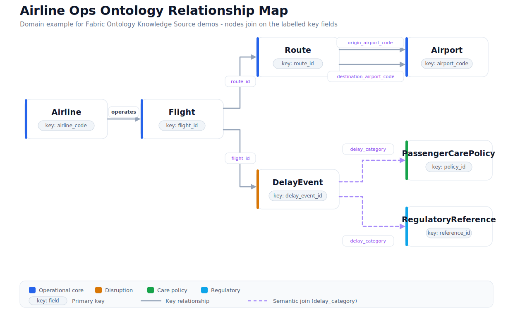

# Airline Ops Ontology Contract

This is the domain reference for the synthetic Airline Ops ontology used by the Fabric Ontology Knowledge Source tutorial.

The main repo README stays focused on Azure AI Search Knowledge Sources and Foundry IQ retrieval. This page goes one layer deeper: it explains the SVG relationship map, the ontology shape, and the validation signals that make the Fabric path credible.

| File | Purpose |
| --- | --- |
| [ontology-map.svg](ontology-map.svg) | Visual relationship map for the Airline Ops ontology, including key fields and semantic joins. |
| [ontology-map.png](ontology-map.png) | PNG rendering for environments that block inline SVG, such as some GitHub views, Notion, or PDF export. |
| [ontology-contract.yaml](ontology-contract.yaml) | Entity, relationship, measure, synonym, and validation-question contract for the Airline Ops sample. |

## Reading The SVG

The SVG is the compact contract for the ontology:

- Blue nodes are the operational core: `Airline`, `Flight`, `Route`, and `Airport`.
- Amber is the disruption event: `DelayEvent`.
- Green and cyan are governance context: `PassengerCarePolicy` and `RegulatoryReference`.
- Solid gray arrows are key relationships between operational entities.
- Dashed purple arrows are semantic joins from `DelayEvent.delay_category` into policy and regulatory reference data.

The important part is not the diagram styling. It is the labelled join fields. Those labels show how a Fabric ontology can expose governed relationships to an Azure AI Search Knowledge Source so the Knowledge Base can answer cross-entity questions without guessing table joins from raw text.

## Entity Map

| Entity | Primary key | Role in the sample |
| --- | --- | --- |
| `Airline` | `airline_code` | Carrier-level business entity with region, alliance, and care tier. |
| `Airport` | `airport_code` | Origin, destination, and hub context for routes. |
| `Route` | `route_id` | Origin-destination market with distance and market type. |
| `Flight` | `flight_id` | Operational flight record with schedule, actual timing, and delay state. |
| `DelayEvent` | `delay_event_id` | Delay cause, controllability, exposure, and disruption summary. |
| `PassengerCarePolicy` | `policy_id` | Care actions that apply to delay categories and trigger conditions. |
| `RegulatoryReference` | `reference_id` | Carrier-neutral regulatory or policy references for disruption scenarios. |

## Relationship Contract

| Relationship | Join |
| --- | --- |
| Airline operates Flight | `Airline.airline_code -> Flight.airline_code` |
| Route has origin Airport | `Route.origin_airport_code -> Airport.airport_code` |
| Route has destination Airport | `Route.destination_airport_code -> Airport.airport_code` |
| Flight uses Route | `Flight.route_id -> Route.route_id` |
| Flight has DelayEvent | `Flight.flight_id -> DelayEvent.flight_id` |
| DelayEvent matches PassengerCarePolicy | `DelayEvent.delay_category -> PassengerCarePolicy.applicable_delay_category` |
| DelayEvent matches RegulatoryReference | `DelayEvent.delay_category -> RegulatoryReference.applicable_delay_category` |

The last two relationships are semantic joins. They are intentionally category- and trigger-driven rather than airline-name-driven, because policy and regulatory guidance should not depend on literal carrier names appearing in source text.

## How To Use It

Use the contract when creating or mapping a Fabric ontology in your own tenant:

1. Load the CSV files from [samples/data/airline-ops](../../data/airline-ops/README.md).
2. Create equivalent entities, fields, and relationships in Fabric.
3. Add business-friendly synonyms for airline, carrier, route, delayed flight, controllable delay, and customer-care exposure.
4. Validate the expected counts and questions before creating the Azure AI Search Fabric Ontology Knowledge Source.

## Expected Validation Signals

| Signal | Expected value |
| --- | ---: |
| Airlines | 5 |
| Airports | 8 |
| Routes | 8 |
| Flights | 15 |
| Delayed flights over 15 minutes | 10 |
| Delay events | 10 |
| Passenger-care policies | 4 |
| Regulatory references | 4 |
| Customer-care exposure | 15,800 USD |

The top customer-care exposure carrier is `Alpine Air`, a fictional carrier name.

## Questions This Ontology Should Support

Use these questions as acceptance checks before connecting the Fabric ontology to a Knowledge Source:

- Which airlines have the highest customer-care exposure this month?
- Which routes have the most delayed flights over 15 minutes?
- Which delay categories are controllable and driving customer-care exposure?
- Which passenger-care policies or regulation topics explain the risk for the highest-exposure airline?
- List delayed flights from the transcontinental market and explain the related route and airline.

## Boundary

This contract describes the ontology shape expected by the sample. It is not a production ontology and does not represent real airline performance, risk, or compliance findings.

For setup details, see [Fabric Ontology Prerequisites](../../../docs/fabric-ontology-prerequisites.md).
